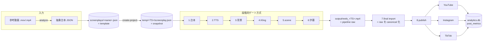

# アーキテクチャ

本ドキュメントは short_movie_generator のシステム構成・レイヤ・依存方向・技術スタック・データフロー・認証経路を 1 ページに集約する。実装の詳細は各モジュールの doc / 関連 docs (`content-strategy.md` `architecture-decisions.md` `abstract-screenplay-design.md`) を参照。

---

## 1. 全体構成



各 stage は **承認 (approve) を経るまで次 stage に進まない**。Stage 7 は auto_loop が pipeline raw を canonical 化する内部経路で、Stage 8 はユーザの publish コマンドが起点 (= `run-next` では自動起動しない)。

---

## 2. レイヤと依存方向

```
┌────────────────────────────────────────────────────────────┐
│ エントリ層                                                 │
│  main.py / preview_server.py / scripts/*.py               │
└──────────────────────┬─────────────────────────────────────┘
                       ▼
┌────────────────────────────────────────────────────────────┐
│ オーケストレータ層                                         │
│  staged_pipeline.py (stage dispatcher)                    │
│  progress_store.py (gate 制御)                             │
│  preflight.py / screenplay_validator.py                    │
└──────────────────────┬─────────────────────────────────────┘
                       ▼
┌────────────────────────────────────────────────────────────┐
│ 生成・編集層 (stage 実装)                                  │
│  scene_gen.py (BG / Kling / scene 合成)                    │
│  compositor.py (字幕焼き込み)                              │
│  audio_dynamics.py / furigana_store.py / post_captions_gen │
│  final_import/ (取込)                                      │
│  platform_clients/ (公開)                                  │
└──────────────────────┬─────────────────────────────────────┘
                       ▼
┌────────────────────────────────────────────────────────────┐
│ 外部 API クライアント層                                    │
│  elevenlabs_client / imagen_client / fal_video_client      │
│  fal_runner / lipsync_client / whisper_client              │
│  video_analyzer (Claude)                                   │
└──────────────────────┬─────────────────────────────────────┘
                       ▼
┌────────────────────────────────────────────────────────────┐
│ ユーティリティ・基盤層                                     │
│  io_utils / log_setup / config / artifact_integrity        │
│  bg_cache / kling_cache / cache/ / cost_tracking/          │
└────────────────────────────────────────────────────────────┘

並走する独立トラック:
  analyze/   — 参考動画 → 抽象台本 (Claude + Whisper + librosa)
  analytics/ — SQLite DB と auto-tag (Claude Haiku)
```

### 依存方向の規則

- **上層は下層に依存して良い**。下層は上層を知らない (= 逆方向依存禁止)
- **同層間の依存は最小限に**。例えば `scene_gen.py` と `compositor.py` は直接互いを呼ばず、`staged_pipeline.py` が両方を呼ぶ
- **外部 API クライアント層は副作用の入口**。テストではここをモックする
- `analyze/` と `analytics/` は **orthogonal** (= メイン生成パイプラインから独立)。互いに知らない

---

## 3. 技術スタック (Stage × 外部 API)

| Stage           | 役割                   | 主要 API / ライブラリ                                  | 認証 env                                         |
| --------------- | ---------------------- | ------------------------------------------------------ | ------------------------------------------------ |
| Stage 1 (台本)  | 検証 + メタ書き出し    | `screenplay_validator` (純ローカル)                    | —                                                |
| Stage 2 (TTS)   | 1-shot 全体合成        | ElevenLabs eleven_v3 (`with-timestamps`)               | `ELEVENLABS_API_KEY`                             |
| Stage 3 (BG)    | scene 別背景画像       | Google Imagen `gemini-3-pro-image-preview`             | `GOOGLE_API_KEY`                                 |
| Stage 4 (動画)  | I2V アニメーション     | fal.ai Kling V3 Standard                               | `FAL_KEY`                                        |
| Stage 5 (scene) | 音声重ね + lipsync     | FFmpeg + Sync.so `lipsync-2`                           | `SYNC_API_KEY`                                   |
| Stage 6 (字幕)  | ASS 焼き込み + caption | FFmpeg + libass + Claude Haiku (caption 生成)          | `ANTHROPIC_API_KEY`                              |
| Stage 7 (取込)  | raw を canonical 化    | (純ローカル、外部 API なし)                            | —                                                |
| Stage 8 (公開)  | YouTube / IG / TikTok  | YouTube Data API v3 / Graph API (stub) / Display API   | `YOUTUBE_OAUTH_*` / `INSTAGRAM_*` / `TIKTOK_*`   |
| analyze         | 参考動画逆算           | Claude Opus 4.7 + OpenAI Whisper (or `faster-whisper`) | `ANTHROPIC_API_KEY` 必須 / `OPENAI_API_KEY` 任意 |
| auto-tag        | hook_type 等の付与     | Claude Haiku                                           | `ANTHROPIC_API_KEY`                              |

詳細な単価とコスト構造は `docs/architecture-decisions.md` を参照。

---

## 4. 設計パターン

### 4.1 Stage 関数の DI 化

各 stage 関数は **外部 API クライアントを引数で受け取る**。テストでは fake client を渡す。

```python
def run_tts_stage(
    screenplay: Screenplay,
    ts_path: Path,
    *,
    tts_client: TTSClient = elevenlabs_client.default(),
    cost_tracker: CostTracker = cost_tracking.default(),
) -> Path:
    ...
```

新規 stage や client を増やす場合もこの形を踏襲する。

### 4.2 Idempotency と中断再開

各 stage は **ファイル存在チェック + 整合性検証 (`artifact_integrity`) でスキップ判定**する。同じ TS で同じ stage を 2 回実行しても壊れない。

- 既に `bg_<S>.png` があり整合性 OK → skip
- 整合性 NG (= truncated 等) → 削除して再生成
- 環境変数 `ARTIFACT_INTEGRITY_AUTO_DELETE=1` で自動削除を有効化

### 4.3 Two SSOT 分離

screenplay は責務を 2 つに分離。**VideoStyle は廃止** (= 各 scene が `animation_style` / `location_ref` / `character_selection` を直接持つ)。

| SSOT               | 場所                                 | 内容                                                                |
| ------------------ | ------------------------------------ | ------------------------------------------------------------------- |
| キャラエンティティ | `characters/<base>/...`              | 全身参照画像 (衣装バリアント) と voice メタ                         |
| ロケ集             | `locations/<id>.json` + .preview.png | 1 ロケ = decor + lighting + color_palette + props + camera_distance |

screenplay の `character_refs` / `location_ref` はこの 2 SSOT を**参照するだけ**で、本体を持たない。

### 4.4 Template / Snapshot 分離

| 種別             | パス                        | 用途                                                                 |
| ---------------- | --------------------------- | -------------------------------------------------------------------- |
| template         | `screenplays/<name>.json`   | 新規 project 作成時の素材 (git 追跡)                                 |
| project snapshot | `temp/<TS>/screenplay.json` | template から copy された immutable な作業コピー (Stage 1〜6 はここ) |

project 作成後に template が外部で書き換わっても、進行中 project は影響を受けない。

---

## 5. データフロー (永続化対象)

```
[git 追跡]
  screenplays/<name>.json       ← 台本テンプレート
  characters/<base>/*           ← キャラ参照画像 + voice.json
  locations/<id>.json + preview ← ロケ詳細
  config.py                     ← 全体設定

[git ignore / 動的生成]
  temp/<TS>/                    ← 1 動画分のプロジェクト
    screenplay.json             ← snapshot
    metadata.json               ← sha / final_versions[] / published_posts[]
    tmp-progress.json           ← stage gate 状態
    tmp/*                       ← 中間アーティファクト
    final/*                     ← Stage 7 取込済み (複数バージョン)
  output/reels_<TS>.mp4         ← Stage 6 で書き出される pipeline raw
  post_captions/<title>.md      ← SNS キャプション
  data/analytics.db             ← SQLite (screenplays / videos / posts / post_metrics)
  data/cost_records.jsonl       ← analyze pipeline のコスト履歴
  data/pricebook.json           ← 単価カタログ
```

---

## 6. 認証 / 環境変数マトリクス

| 区分             | env                                                                 | 必須/任意         | 用途                                                                                                 |
| ---------------- | ------------------------------------------------------------------- | ----------------- | ---------------------------------------------------------------------------------------------------- |
| 生成パイプライン | `ANTHROPIC_API_KEY`                                                 | 必須              | analyze / auto-tag / caption 生成                                                                    |
|                  | `ELEVENLABS_API_KEY`                                                | 必須              | TTS (Stage 2)                                                                                        |
|                  | `GOOGLE_API_KEY`                                                    | 必須              | Imagen 背景生成 (Stage 3)                                                                            |
|                  | `FAL_KEY`                                                           | 必須              | Kling V3 (Stage 4)                                                                                   |
|                  | `OPENAI_API_KEY`                                                    | 任意              | Whisper (analyze)。無ければ `faster-whisper` ローカル                                                |
|                  | `SYNC_API_KEY`                                                      | 必須              | Sync.so lipsync (Stage 5)                                                                            |
| 公開             | `YOUTUBE_OAUTH_CLIENT_ID` / `_CLIENT_SECRET` / `_REFRESH_TOKEN`     | YouTube 公開時    | refresh token で headless 上げ                                                                       |
|                  | `YOUTUBE_API_KEY`                                                   | metrics 取得時    | 公開統計                                                                                             |
|                  | `INSTAGRAM_ACCESS_TOKEN` / `INSTAGRAM_BUSINESS_ID`                  | IG metrics 時     | Graph API                                                                                            |
|                  | `TIKTOK_ACCESS_TOKEN` / `TIKTOK_OPEN_ID`                            | TikTok metrics 時 | Display API                                                                                          |
| analytics        | `ANALYTICS_DB_PATH`                                                 | 任意              | 既定 `data/analytics.db`                                                                             |
| 観測             | `LOG_LEVEL` / `LOG_FILE`                                            | 任意              | logging モジュール                                                                                   |
| 運用 gate        | `ARTIFACT_INTEGRITY_AUTO_DELETE`                                    | 任意              | 整合性 NG の自動削除                                                                                 |
| (Phase 1+ 予定)  | `DISABLE_AUTO_LOOP` / `DAILY_COST_CAP_USD` / `SLACK_WEBHOOK_URL` 他 | 任意              | フルオートループの安全装置 (`docs/plannings/2026-05-07_full-automation-implementation-plan.md` 参照) |

---

## 7. ディレクトリレイアウト (主要のみ)

```
short_movie_generator/
  main.py                       ← CLI エントリ
  preview_server.py             ← Flask ベースの HTTP API
  staged_pipeline.py            ← stage dispatcher
  progress_store.py             ← gate 制御
  scene_gen.py                  ← BG / Kling / scene 合成
  compositor.py                 ← 字幕焼き込み
  config.py                     ← 全体設定
  screenplay_validator.py
  preflight.py
  artifact_integrity.py

  analyze/                      ← 参考動画 → 抽象台本
    pipeline.py / runner.py / compose.py / cost.py / job.py
  final_import/                 ← Stage 7
    core.py / fingerprint.py / publish.py / watcher.py
  platform_clients/             ← Stage 8
    youtube.py / instagram.py / tiktok.py
  analytics/                    ← SQLite + auto-tag
    db.py / schema.sql / auto_tag.py

  characters/<base>/            ← キャラ SSOT
  locations/<id>.json           ← ロケ SSOT
  screenplays/<name>.json       ← 台本テンプレート

  scripts/                      ← analyze / ingest / fetch_metrics 等の補助 CLI
  tests/
  frontend/                     ← React (Vite)
  docs/
    developments/               ← 静的ドキュメント (本ファイル等)
    plannings/                  ← フロー文書 (= YYYY-MM-DD_*.md)
```

---

## 8. 実行形態

| モード          | 起動                                                              | 用途                                |
| --------------- | ----------------------------------------------------------------- | ----------------------------------- |
| 単発 (CLI)      | `python3 main.py <名前>` / `python3 main.py <名前> --resume <TS>` | 1 stage ずつ手動実行                |
| プレビュー UI   | `python3 preview_server.py` + `cd frontend && npm run dev`        | 承認サイクル + 可視化               |
| analyze (補助)  | `python3 scripts/analyze_video.py <参考動画>`                     | 参考動画 → 抽象台本 JSON            |
| analytics 補助  | `python3 scripts/{ingest,register_post,fetch_metrics}.py`         | DB 取込 / 投稿登録 / メトリクス取得 |
| dashboard       | `streamlit run scripts/dashboard.py`                              | 横断ビュー閲覧                      |
| (Phase 1+ 予定) | `python3 scripts/auto_loop.py` (cron)                             | フルオート量産                      |

**本番デプロイは無い** (= ローカル実行のみ)。Phase 4 で実験用 SNS アカウント運用 → 本番アカウント移行を検討する。

### 8.1 Tailscale 経由でモバイル等から触る

ローカル Mac で動かす preview_server を、外出先のスマホ / 別 PC から Tailscale (または Cloudflare Tunnel / WireGuard) 経由で触る運用を想定。**VPS には乗せない**。Tailscale が L4 で暗号化 + デバイス認証 + ネットワーク隔離を担うので、本体 server の auth/CORS/HTTPS は最低限で済む。

#### 起動手順

```bash
# 1. Tailscale で割り当てられた 100.x.x.x の IPv4 を取得
export FLASK_HOST=$(tailscale ip -4 | head -1)

# 2. (任意) 同 LAN の他デバイス誤爆防止に bearer token を設定
export PREVIEW_AUTH_TOKEN=$(openssl rand -hex 16)

# 3. server 起動
python3 preview_server.py
```

#### Vite (frontend dev) からも token を送る

`frontend/.env.local` を作って以下を入れる:

```
VITE_PREVIEW_TOKEN=<= preview_server で設定したのと同じ値>
```

`frontend/src/api.ts` の fetch wrapper が自動で `Authorization: Bearer <token>` を付与する。

#### Auth bypass の例外

`<video src="/asset/...">` / `` 系の asset GET と OPTIONS preflight は Authorization ヘッダを付けられないので **token check を bypass** する。Tailscale で守る前提なので問題にならない。`/api/*` のミューテーションは全て token 必須。

#### 強度の根拠

- **第一防衛**: Tailscale (= 暗号化 + デバイス認証 + 100.64.0.0/10 隔離)
- **第二防衛**: `PREVIEW_AUTH_TOKEN` (= 「ホテル WiFi で他端末が偶然 100.x.x.x:5555 を叩く」程度の事故防止)

公開 URL を作らない以上、SSO/OAuth/WAF は不要。

---

## 9. 関連ドキュメント

- `docs/developments/ubiquitous-language.md` — ドメイン用語辞書
- `docs/architecture-decisions.md` — モデル選定・コスト構造・プロンプト設計の根拠
- `docs/abstract-screenplay-design.md` — analyze pipeline + compose の設計
- `docs/content-strategy.md` — 動画制作の根本戦略
- `docs/plannings/2026-05-07_full-automation-feasibility.md` — フルオートループの判定
- `docs/plannings/2026-05-07_full-automation-implementation-plan.md` — フルオート実装計画

---

最終更新: 2026-05-09
