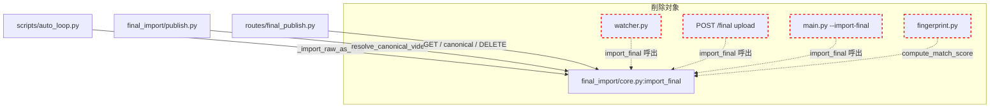

# 外部編集経路の削除計画

**date**: 2026-05-09 / **base branch**: `main`

外部の動画編集ソフトを使った手動編集 + 編集後動画を `temp/<TS>/final/` に
取り込んで紐付ける運用フローを完全廃止する。pipeline は `auto_loop` 内で
raw 動画を直接 canonical 化する経路 (= `_import_raw_as_final()`) に統一する。

---

## 0. 目的

- **暗黙知の解消** — 外部編集ソフトの操作スキルが特定の人間に属人化する状況を解消
- **設計のシンプル化** — final import の発火経路を 3 (= watchdog / HTTP upload / CLI) から
  1 (= auto_loop 内呼出) に縮退
- **メンテ対象コードの削減** — 約 600-800 行 (= テスト含む) の削除
- **将来 pipeline 内 post-processing が完成した際の移行コスト削減** — 経路を先に統一しておけば、
  composed.mp4 への切替が 1 行で済む

---

## 1. スコープ

### 1.1 削除対象

| カテゴリ       | 対象                                                                         | 概要                                                                                   |
| -------------- | ---------------------------------------------------------------------------- | -------------------------------------------------------------------------------------- |
| backend module | `final_import/watcher.py`                                                    | watchdog による `final/` ディレクトリ監視 (= 全削除)                                   |
| backend module | `final_import/fingerprint.py`                                                | 音声指紋による誤投入検出 (= 全削除、唯一の利用箇所が core.py:183)                      |
| backend core   | `final_import/core.py` の修正                                                | `SourceLiteral` を `"cli"` 固定に / `skip_fingerprint` パラメータと関連処理を削除      |
| routes         | `routes/final_publish.py:api_upload_final` (POST `/api/projects/<ts>/final`) | UI からの drag&drop upload endpoint                                                    |
| frontend       | `frontend/src/components/stages/StageFinalImport.tsx` の drag&drop UI        | 動画ドロップゾーン + アップロード進捗 + skip_fingerprint チェックボックス              |
| frontend api   | `frontend/src/api.ts:uploadFinal` メソッド                                   | XMLHttpRequest による multipart upload                                                 |
| CLI            | `main.py --import-final <PATH>` / `--no-fingerprint` 引数                    | argparse から削除 + `_run_stage8_9` の `args.import_final` 分岐を削除                  |
| preview_server | `_start_final_watcher_if_enabled()` 関数と呼び出し                           | 起動時の watchdog spawn                                                                |
| env            | `DISABLE_FINAL_WATCHER` / `FINAL_WATCHER_STABLE_SEC` 参照                    | 環境変数の利用箇所をすべて削除                                                         |
| tests          | `tests/test_final_import_watcher.py` (全削除)                                | watchdog 専用テスト                                                                    |
| tests          | `tests/test_final_import_fingerprint.py` (全削除)                            | 音声指紋専用テスト                                                                     |
| tests          | `tests/test_final_import.py` の `source="watch"` / `"ui"` ケース             | 該当ケースのみ削除                                                                     |
| tests          | `tests/test_preview_server_final.py` の drop 経路ケース                      | 該当ケースのみ削除                                                                     |
| docs           | `CLAUDE.md` の Stage 7 説明                                                  | 「watchdog / UI ドロップゾーン / CLI」3 経路の記述を「raw → canonical 直結」に書き換え |

### 1.2 残す対象

| カテゴリ     | 対象                                                                                                                                                                        | 役割                                                                                                                                 |
| ------------ | --------------------------------------------------------------------------------------------------------------------------------------------------------------------------- | ------------------------------------------------------------------------------------------------------------------------------------ |
| backend      | `final_import.import_final(ts, src, source="cli")`                                                                                                                          | auto_loop の `_import_raw_as_final()` 専用経路 (= 唯一の発火点)                                                                      |
| backend      | `final_import.list_final_versions` / `set_canonical_final` / `delete_final_version` / `resolve_canonical_video` / `final_dir` / `canonical_final_path` / `ensure_final_dir` | composed 版の管理 (= 複数 recipe で複数 composed を作るケース対応)                                                                   |
| backend      | `final_import.FinalVersion` / `FINAL_DIR_NAME`                                                                                                                              | 構造体・定数                                                                                                                         |
| routes       | `routes/final_publish.py` の他 endpoint                                                                                                                                     | `GET /final` (= 一覧) / `POST /final/<filename>/canonical` / `DELETE /final/<filename>` / `GET /asset/<ts>/final-version/<filename>` |
| frontend     | `StageFinalImport.tsx` の versions 一覧 + canonical 切替ボタン + プレビュー                                                                                                 | composed 版の選択 UI                                                                                                                 |
| frontend api | `listFinals` / `setCanonicalFinal` / `deleteFinal` / `finalVersionAssetUrl`                                                                                                 | composed 版操作の HTTP client                                                                                                        |
| CLI          | `main.py --list-finals` / `--canonical <FILENAME>` / `--publish`                                                                                                            | composed 版の確認・選択・公開                                                                                                        |
| auto_loop    | `scripts/auto_loop.py:_import_raw_as_final()`                                                                                                                               | 唯一の取込経路                                                                                                                       |

---

## 2. 影響範囲分析

### 2.1 ファイル別変更一覧

| ファイル                                              | 操作                                                            | 規模       |
| ----------------------------------------------------- | --------------------------------------------------------------- | ---------- |
| `final_import/watcher.py`                             | rm                                                              | -約 250 行 |
| `final_import/fingerprint.py`                         | rm                                                              | -約 130 行 |
| `final_import/core.py`                                | edit (= `SourceLiteral` 簡略化 + fingerprint 関連削除)          | -約 30 行  |
| `final_import/__init__.py`                            | (変更なし、watcher / fingerprint は元から re-export していない) | ±0         |
| `routes/final_publish.py`                             | edit (= `api_upload_final` 削除)                                | -約 50 行  |
| `preview_server.py`                                   | edit (= `_start_final_watcher_if_enabled` + 呼出削除)           | -約 20 行  |
| `frontend/src/api.ts`                                 | edit (= `uploadFinal` メソッド削除)                             | -約 30 行  |
| `frontend/src/components/stages/StageFinalImport.tsx` | edit (= drop UI + 進捗 + チェックボックス削除)                  | -約 100 行 |
| `main.py`                                             | edit (= argparse + `_run_stage8_9` の関連分岐)                  | -約 20 行  |
| `tests/test_final_import.py`                          | edit (= source 関連ケース削除)                                  | -約 30 行  |
| `tests/test_final_import_watcher.py`                  | rm                                                              | -約 200 行 |
| `tests/test_final_import_fingerprint.py`              | rm                                                              | -約 100 行 |
| `tests/test_preview_server_final.py`                  | edit (= drop 経路テスト削除)                                    | -約 50 行  |
| `CLAUDE.md`                                           | edit (= Stage 7 説明)                                           | ±0         |
| `.env.example`                                        | (該当 env が記載されていれば削除)                               | -2 行      |

合計: **約 -1000 行** (= テスト + コード + ドキュメント込み)

### 2.2 依存関係グラフ



削除後は AUTO / PUB / ROUTES の 3 経路だけが CORE に依存する。

### 2.3 互換性

- **既存 final_versions[] のデータ**: そのまま使える (= 構造変更なし)
- **`source` フィールドの値**: 既存データに `"watch"` / `"ui"` があっても表示には支障なし
  (= 表示時の文字列、frontend で「外部由来」「auto_loop」のラベルだけ調整)
- **migration script は不要** (= 既存 final_versions[] は読み込み可能)

---

## 3. 実装手順

### 3.1 順序

```
Step 1: 専用ブランチ chore/remove-external-edit-import-path を切る
Step 2: backend 削除 (= 依存関係の上流から下流に)
        2-A: routes/final_publish.py:api_upload_final 削除
        2-B: preview_server.py の watcher 呼出削除
        2-C: final_import/watcher.py 削除
        2-D: final_import/core.py の source / skip_fingerprint 整理
        2-E: final_import/fingerprint.py 削除
Step 3: frontend 削除
        3-A: frontend/src/api.ts:uploadFinal 削除
        3-B: StageFinalImport.tsx の drop UI 削除
Step 4: CLI 削除
        4-A: main.py の argparse + _run_stage8_9 分岐
Step 5: tests
        5-A: test_final_import_watcher.py / test_final_import_fingerprint.py 削除
        5-B: test_final_import.py / test_preview_server_final.py 該当ケース削除
Step 6: docs
        6-A: CLAUDE.md の Stage 7 節更新
        6-B: .env.example から該当 env 行削除 (= 該当があれば)
Step 7: 検証
        7-A: pytest 全関連 suite
        7-B: tsc --noEmit
        7-C: auto_loop 経路の smoke (= raw → canonical 化が動くこと)
Step 8: commit + PR
```

### 3.2 各 Step の詳細

#### Step 2-A: `routes/final_publish.py:api_upload_final` 削除

```python
# 削除対象
@final_publish_bp.route("/api/projects/<ts>/final", methods=["POST"])
def api_upload_final(ts):
    ...
```

`request.files` / `staging_dir` / `import_final` 呼出を含む約 35 行を削除。
GET `/final` (= 一覧) と他 endpoint は残す。

#### Step 2-B: `preview_server.py` の watcher 削除

```python
# 削除対象 (preview_server.py:1437-1549)
def _start_final_watcher_if_enabled() -> None:
    if os.environ.get("DISABLE_FINAL_WATCHER", "").lower() in ("1", "true", "yes"):
        ...

# 削除対象 (preview_server.py:1549)
_start_final_watcher_if_enabled()
```

#### Step 2-C: `final_import/watcher.py` を rm

```bash
git rm final_import/watcher.py
```

#### Step 2-D: `final_import/core.py` の整理

```python
# 変更前
SourceLiteral = Literal["watch", "ui", "cli"]

def import_final(
    ts: str,
    src: str,
    *,
    source: SourceLiteral = "cli",
    skip_fingerprint: bool = False,
) -> FinalVersion:
    ...
    if not skip_fingerprint:
        from .fingerprint import compute_match_score
        score = compute_match_score(ts_path, dst_name)
        ...

# 変更後
def import_final(ts: str, src: str) -> FinalVersion:
    """Stage 7 取込: ``src`` を ``temp/<TS>/final/<HHMMSS>.mp4`` に配置し、
    ``final_versions[]`` に登録する。auto_loop の `_import_raw_as_final()`
    から呼ばれる唯一の経路。
    """
    ...
    # source は内部で "cli" 固定 (= もし既存 final_versions に "watch" / "ui" 値が
    # あっても読み込みには支障なし、新規登録時のみ "cli" で書き込む)
```

`SourceLiteral` 型自体は core.py 内部の値なので削除可能 (= `FinalVersion.source: str`
のままで OK、型を Literal に縛らない)。

#### Step 2-E: `final_import/fingerprint.py` を rm

```bash
git rm final_import/fingerprint.py
```

#### Step 3-A: `frontend/src/api.ts:uploadFinal` 削除

```typescript
// 削除対象 (api.ts:328-359)
uploadFinal: (
  ts: string,
  file: File,
  opts?: { skipFingerprint?: boolean; onProgress?: (pct: number) => void },
): Promise<{ final_version: FinalVersion }> => {
  ...
}
```

#### Step 3-B: `StageFinalImport.tsx` の drop UI 削除

drop zone (= `onDrop` / `onDragOver` handler / 進捗表示 / skip_fingerprint
チェックボックス) を削除。残るのは:

- canonical 表示
- versions 一覧
- canonical 切替ボタン
- 削除ボタン
- プレビュー動画

#### Step 4-A: `main.py` の argparse 削除

```python
# 削除対象
g.add_argument("--import-final", dest="import_final", metavar="PATH", ...)
g.add_argument("--no-fingerprint", action="store_true", ...)

# _run_stage8_9 内
if args.import_final:
    try:
        v = final_import.import_final(
            ts, args.import_final, source="cli",
            skip_fingerprint=args.no_fingerprint,
        )
    ...

# args.import_final or 部分も削除
if args.import_final or args.list_finals or args.canonical or args.publish:
    →
if args.list_finals or args.canonical or args.publish:
```

`parser.error` の文言からも `--import-final` 言及を削除。

#### Step 6-A: `CLAUDE.md` の Stage 7 節更新

該当箇所:

```
| 7. final_import | `temp/<TS>/final/<HHMMSS>.mp4` (複数バージョン) |
  CapCut 編集後の動画。watchdog が `final/` への drop を自動検知 +
  音声指紋で誤投入を検出。canonical を選んで承認すると Stage 8 へ |
```

書き換え後:

```
| 7. final_import | `temp/<TS>/final/<HHMMSS>.mp4` |
  Stage 6 の raw 出力を auto_loop が `_import_raw_as_final()` で取込み、
  canonical 化する。複数 composed 版が存在する場合は UI / CLI で canonical を切替可能 |
```

「## Stage 7 取込 + Stage 8 公開」のセクションも 3 経路の表を 1 経路に縮退。

---

## 4. リスク + 対処

| リスク                                                                    | 確率 | 影響 | 対処                                                                                              |
| ------------------------------------------------------------------------- | ---- | ---- | ------------------------------------------------------------------------------------------------- |
| auto_loop 以外で `final_versions[]` を生成する経路が将来必要になる        | 低   | 中   | git で復元可能。実装規模が小さいため、必要になったら `feat/restore-external-edit-import` で復活   |
| 既存 final_versions に `"watch"` / `"ui"` source 値が残っている動画の表示 | 低   | 低   | `FinalVersion.source: str` は読み込み可能、表示時に「外部由来」と判別表示するなら frontend で対応 |
| `compute_match_score` を別用途 (= 動画品質評価) で使う計画                | 低   | 中   | 削除前に grep で全利用箇所を確認済み。core.py:183 が唯一の利用、他には参照なし                    |
| watchdog の Observer thread が起動中に削除を deploy                       | 低   | 低   | preview_server を再起動すれば解消。削除後は二度と起動しない                                       |
| frontend ビルドの import エラー                                           | 中   | 中   | tsc --noEmit で事前検出、CI が通らなければ deploy 不可                                            |
| pytest CI が watcher / fingerprint テストの import で失敗                 | 中   | 中   | 該当テストファイル全削除で解消、conftest からの import がないことも確認                           |
| `DISABLE_FINAL_WATCHER` / `FINAL_WATCHER_STABLE_SEC` を運用 env で参照中  | 低   | 低   | 該当 env を unset しても挙動は変わらない (= 削除後は誰も読まない)                                 |

---

## 5. 検証

### 5.1 自動検証

```bash
# 全関連 pytest
pytest tests/test_final_import.py tests/test_preview_server_final.py \
       tests/test_publish_flow.py tests/test_routes_youtube_channel.py \
       tests/test_publish_channel_guard.py tests/test_youtube_client.py \
       tests/test_youtube_upload.py

# frontend 型チェック
cd frontend && npx tsc --noEmit
```

期待: 全 pass / エラー 0。

### 5.2 smoke 検証

```bash
# auto_loop 経路の取込が動くことを確認
# (= preview_server を起動 + 既存 project で auto_loop._import_raw_as_final 呼出)
python3 -c "
from scripts.auto_loop import _import_raw_as_final
# 既存の TS で raw → canonical 化が走ることを smoke
"

# CLI から残っている操作が動くことを確認
python3 main.py --resume <既存 TS> --list-finals
```

期待: list-finals が表示される / canonical 切替できる。

### 5.3 grep による参照漏れチェック

```bash
# 削除対象が参照されていないことを確認
grep -rnE "DISABLE_FINAL_WATCHER|FINAL_WATCHER_STABLE_SEC|skip_fingerprint|--no-fingerprint|--import-final|api_upload_final|compute_match_score|from final_import.watcher|from final_import.fingerprint" \
  --include="*.py" --include="*.ts" --include="*.tsx" --include="*.md" .
```

期待: 削除後の grep 結果は **空** または `docs/plannings/2026-05-09_external-edit-import-removal.md` (= 本ドキュメント) のみ。

---

## 6. 実装タスクリスト

### Step 1: ブランチ作成

- [x] `git checkout -b chore/remove-external-edit-import-path`

### Step 2: backend 削除

- [ ] `routes/final_publish.py:api_upload_final` 削除
- [ ] `preview_server.py` の `_start_final_watcher_if_enabled` 削除 + 呼出削除
- [ ] `final_import/watcher.py` を `git rm`
- [ ] `final_import/core.py` の `SourceLiteral` 整理 + `skip_fingerprint` パラメータ削除 + fingerprint import 削除
- [ ] `final_import/fingerprint.py` を `git rm`

### Step 3: frontend 削除

- [ ] `frontend/src/api.ts:uploadFinal` メソッド削除
- [ ] `StageFinalImport.tsx` の drag&drop UI 削除 (= drop zone / onDrop / onDragOver / 進捗 / skip_fingerprint チェック)

### Step 4: CLI 削除

- [ ] `main.py` の `--import-final` / `--no-fingerprint` argparse 削除
- [ ] `main.py:_run_stage8_9` の `args.import_final` 分岐削除
- [ ] `parser.error` 文言から `--import-final` 削除

### Step 5: tests

- [ ] `tests/test_final_import_watcher.py` を `git rm`
- [ ] `tests/test_final_import_fingerprint.py` を `git rm`
- [ ] `tests/test_final_import.py` の `source="watch"` / `source="ui"` ケース削除
- [ ] `tests/test_preview_server_final.py` の POST `/final` (= drop 経路) テスト削除

### Step 6: docs

- [ ] `CLAUDE.md` の Stage 7 表 + 「## Stage 7 取込 + Stage 8 公開」節を「raw → canonical 直結」に書き換え
- [ ] `.env.example` から `DISABLE_FINAL_WATCHER` / `FINAL_WATCHER_STABLE_SEC` 行削除 (= 該当があれば)

### Step 7: 検証

- [ ] `pytest tests/test_final_import.py tests/test_preview_server_final.py tests/test_publish_flow.py` 等 関連 suite 全 pass
- [ ] `cd frontend && npx tsc --noEmit` エラー 0
- [ ] grep で削除対象シンボルへの参照が残っていないことを確認
- [ ] preview_server 起動 → Stage 7 ページの drop UI が消えていることを目視

### Step 8: commit + PR

- [ ] commit: `chore: remove external edit import path (watcher / fingerprint / drop UI)`
- [ ] push + `gh pr create --title "chore: remove external edit import path" --base main`

---

## 7. 参考実装 / 残る経路の確認

### 7.1 残る取込経路

```python
# scripts/auto_loop.py:312
def _import_raw_as_final(ts: str) -> None:
    """Stage 6 の pipeline raw を Stage 7 取込として canonical 化する。
    fingerprint 検証は撤廃したため、raw 自体が canonical となる。
    """
    raw_path = os.path.join(config.OUTPUT_DIR, f"reels_{ts}.mp4")
    ...
    final_import.import_final(ts, raw_path)  # source 引数なしで呼出 (= 内部で "cli" 固定)
```

### 7.2 残るルート + UI 操作

| 操作           | 残る経路                                                                                                                    |
| -------------- | --------------------------------------------------------------------------------------------------------------------------- |
| 取込履歴の表示 | UI `StageFinalImport.tsx` の versions 一覧 / `GET /api/projects/<ts>/final` / `python3 main.py --resume <TS> --list-finals` |
| canonical 切替 | UI のボタン / `POST /api/projects/<ts>/final/<filename>/canonical` / `python3 main.py --resume <TS> --canonical <FILENAME>` |
| version 削除   | UI のボタン / `DELETE /api/projects/<ts>/final/<filename>`                                                                  |
| プレビュー再生 | UI 動画タグ / `GET /asset/<ts>/final-version/<filename>`                                                                    |
| 公開           | `python3 main.py --resume <TS> --publish youtube` / UI `StagePublish.tsx`                                                   |

---

## 8. 関連ドキュメント

- `docs/plannings/2026-05-09_quality-parity-auto-vs-manual.md` — 品質パリティ全体計画 (= 本計画は別スコープで独立)
- `CLAUDE.md` — Stage 7 / 8 の運用説明 (= 本計画完了時に更新する)
- `docs/developments/architecture.md` — 全体構成図

---

**最終更新**: 2026-05-09
