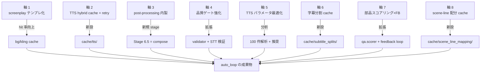
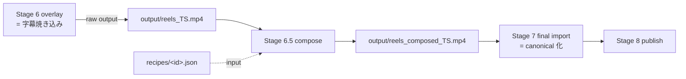
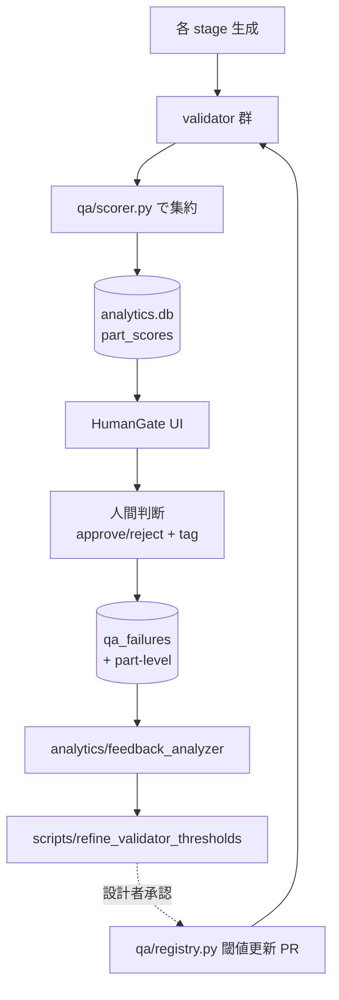
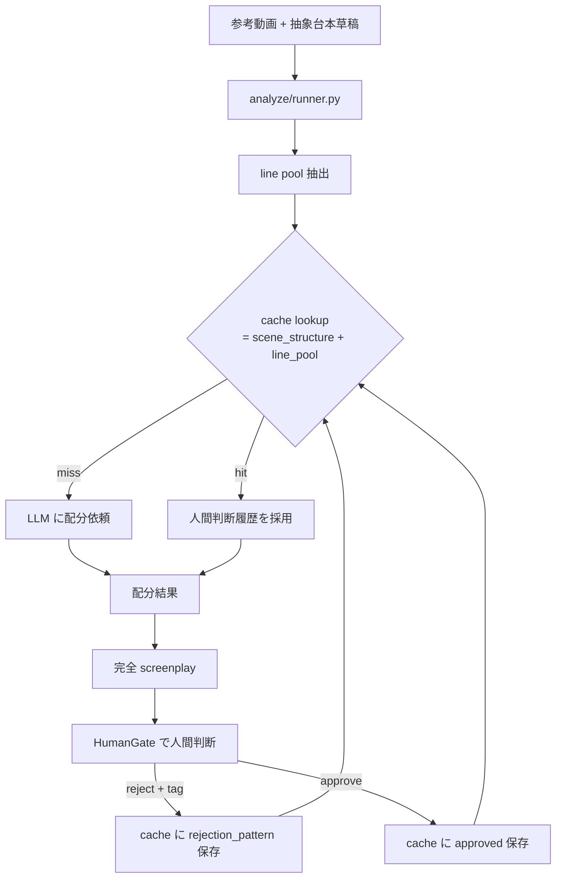
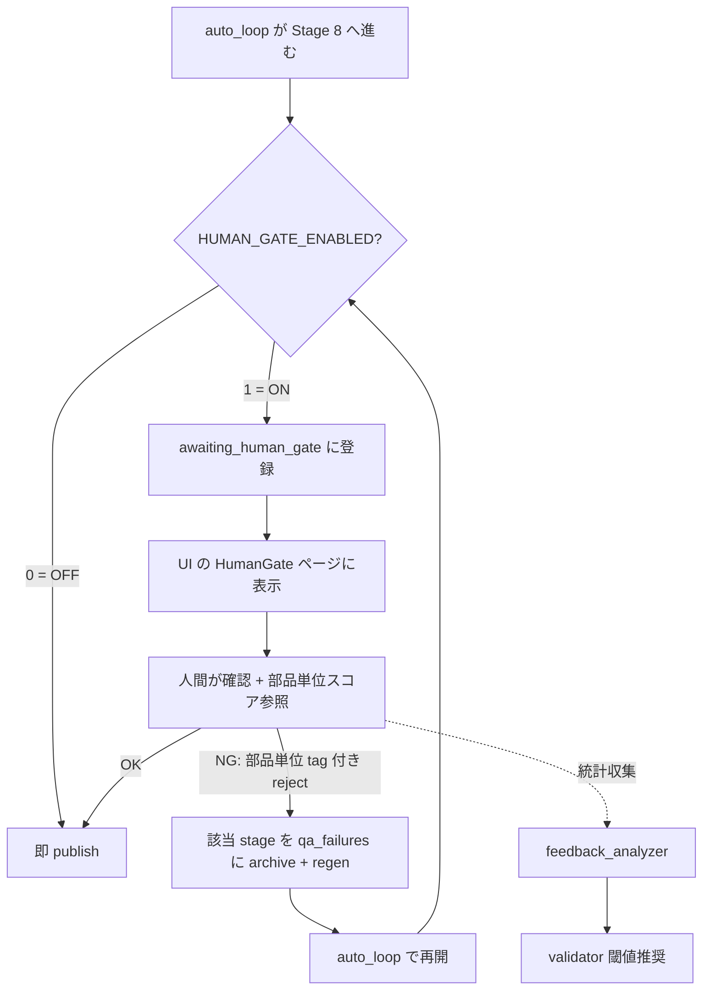

# 手動 vs フルオート 品質パリティ実装計画

**date**: 2026-05-09 / **base branch**: `main`

UI 経由で人間がパイプラインを叩いて作る動画と、`scripts/auto_loop.py` が無人で
吐き出す動画の **成果物品質差** を、技術的・運用的に「気にならないレベル」
(= 85-90% 一致) まで縮めるための網羅的な実装計画。

完全一致 (= 100%) は ElevenLabs TTS の確率性 + 人間判断の主観性により到達不可能。
ゴールは **「100 本中 95-97 本は無人公開、残り 3-5 本だけ human gate で人間救済」** な水準。

---

## 0. 目的とゴール

### 0.1 目的

本プロジェクトは **`scripts/analyze_video.py` で参考動画から抽象台本を逆算 →
auto_loop で量産公開** する設計を中心に運用する。auto_loop が吐き出す成果物が、
UI で人間が個別調整した動画と「区別がつかない」レベルに到達することを目指す。

これにより:

- 量産速度を犠牲にせず品質を担保
- CapCut 等の外部編集経路を **必須から廃止** (= 暗黙知の解消、設計シンプル化)
- 「100 本中 95-97 本は自動公開、残り 3-5 本だけ human gate で人間救済」運用を成立させる

### 0.2 ゴール (= 定量)

| 指標                                                | 現状   | ゴール                                                                    |
| --------------------------------------------------- | ------ | ------------------------------------------------------------------------- |
| 視覚要素 (BG / Kling / scene 構造) の手動一致率     | 30-50% | **95%+**                                                                  |
| 字幕の品質一致率 (= 画面幅収まり / 意味境界)        | 60%    | **90%+**                                                                  |
| TTS の手動一致率                                    | 30-50% | **75-85%** (= 確率性のため完全一致は不可、retry + パラメータ最適化で吸収) |
| post-processing (BGM / intro / outro) の手動一致率  | 0%     | **80-90%**                                                                |
| auto_loop で「公開して問題ない」率                  | 60-70% | **95%+**                                                                  |
| 手動介入が必要な動画の比率 (= human gate で reject) | 30-40% | **3-5%**                                                                  |

### 0.3 スコープ

- ✅ screenplay テンプレ化の運用ルール + 補助ツール
- ✅ TTS の hybrid cache (= screenplay 全体 + line 単位) + 品質 retry + パラメータ最適化
- ✅ 字幕分割 cache (= 形態素解析 + 人間判断 + LLM fallback)
- ✅ 最低限の post-processing 内製 (= intro title + BGM mix + outro CTA + simple fade)
- ✅ 品質ゲート強化 (= STT 検証 / validator 拡張 / human gate 改善)
- ✅ TTS パラメータ最適化のための解析基盤
- ✅ 部品スコアリング + 人間フィードバックによる validator 継続改善
- ✅ scene への line 配分 cache (= analyze pipeline 精度継続改善)

### 0.5 別スコープのドキュメント

外部編集経路 (= 動画編集ソフトを使った手動編集 + 編集後動画の取込) の完全廃止は
別スコープとして `docs/plannings/2026-05-09_external-edit-import-removal.md` に
分離している。本計画とは独立してマージ可能。

### 0.4 非スコープ

- ❌ 動画編集ソフト互換の完全な編集機能 (= 規模過大、別プロジェクト相当)
- ❌ 編集判断 LLM (= 「どこに矢印を出すべきか」を AI 判断、現状の AI 性能で品質安定不可)
- ❌ ML による完全自動の validator 学習 (= ラベル数不足で非現実的、Level 1-2 までで対応)
- ❌ AI モデル独自開発 (= ElevenLabs / Imagen / Kling は外部依存のまま)
- ❌ モーショントラッキング / キーフレームアニメーション
- ❌ コンテンツジャンルの拡大 (= `docs/content-strategy.md` の方針に従い、編集なしで成立する形式に絞る)

---

## 1. 現状の品質差分の構造分析

### 1.1 差分の発生源 (= 7 系統)

| #      | 系統                                                           | 影響度 | 機械検出可能性                            | 現状の cache カバー   |
| ------ | -------------------------------------------------------------- | ------ | ----------------------------------------- | --------------------- |
| **D1** | TTS の確率的ばらつき                                           | 大     | △ STT で部分検出可                        | ❌ project-local のみ |
| **D2** | BG / Kling の cache miss (= 新規 screenplay)                   | 中     | ✅ key 一致で判定                         | ✅ グローバル cache   |
| **D3** | post-processing 不在 (= BGM / intro / トランジション)          | 大     | ❌                                        | ❌ なし               |
| **D4** | 個別 scene / line 調整の不在                                   | 中     | ❌                                        | N/A (= UI 専用)       |
| **D5** | validator の主観品質判定不能                                   | 中     | ❌ AI 課題レベル                          | N/A                   |
| **D6** | 字幕分割の品質低下 (= 画面幅見切れ / 意味境界無視)             | 中     | △ 文字数閾値は検出可、意味境界は LLM 必要 | ❌ なし               |
| **D7** | analyze pipeline の line 配分ばらつき (= LLM 自動配分の揺らぎ) | 中     | ❌                                        | ❌ なし               |

### 1.2 cache 別カバー範囲

| Stage             | キャッシュ種別                            | 別 project で再利用可?   | 実装場所            |
| ----------------- | ----------------------------------------- | ------------------------ | ------------------- |
| TTS (Stage 2)     | project-local (`temp/<TS>/tts_full.mp3`)  | ❌ No                    | `scene_gen.py:1501` |
| BG (Stage 3)      | グローバル (`cache/bg_images/<hash>.png`) | ✅ Yes                   | `bg_cache.py`       |
| Kling (Stage 4)   | グローバル (`cache/kling/<hash>.mp4`)     | ✅ Yes                   | `kling_cache.py`    |
| Scene (Stage 5)   | (合成、決定的処理)                        | △ 入力同じなら結果同じ   | `compositor.py`     |
| Overlay (Stage 6) | (字幕焼き込み、文字数比例分割)            | △ 再現はするが品質に課題 | `compositor.py`     |

---

## 2. 解決アプローチ — 8 軸への分解



### 2.0 軸サマリ

| 軸                                   | 解決する差分        | 規模            | 優先度     |
| ------------------------------------ | ------------------- | --------------- | ---------- |
| 1: screenplay テンプレ化             | D2                  | 小              | ⭐⭐⭐⭐⭐ |
| 2: TTS hybrid cache + retry          | D1                  | 中 (~500 LOC)   | ⭐⭐⭐⭐⭐ |
| 3: post-processing 内製              | D3                  | 大 (~1500 LOC)  | ⭐⭐⭐⭐   |
| 4: 品質ゲート強化                    | D4, D5              | 中 (~800 LOC)   | ⭐⭐⭐⭐   |
| 5: TTS パラメータ最適化              | D1                  | 小 (解析タスク) | ⭐⭐⭐     |
| 6: 字幕分割 cache                    | D6                  | 中 (~600 LOC)   | ⭐⭐⭐⭐   |
| 8: 部品スコアリング + フィードバック | D5 (validator 改善) | 中 (~1000 LOC)  | ⭐⭐⭐     |
| 9: scene → line 配分 cache           | D7                  | 中 (~600 LOC)   | ⭐⭐⭐     |

### 2.1 軸 1: screenplay テンプレ化

#### WHY

bg / kling cache はグローバルで project 横断 hit するが、key 一致が条件。
**「動画ごとの差分を lines.text の中身だけに絞る」** ルールに統一すれば、cache hit 率を
30% → 80%+ に引き上げられる。

#### WHAT

- `screenplays/templates/<series>.json` (= 新ディレクトリ) にシリーズ別テンプレを保存
- 固定する要素: scene の **器** (= location_ref / character_refs / animation_prompt /
  camera_distance / scene 数)
- 動画ごとに自由な要素: **lines の中身と本数** (= scene の duration_target に応じて
  結果的に近い本数になる傾向はあるが、厳密な縛りはない)
- `scripts/derive_from_template.py` (新規) でテンプレ + lines セット → 完成 screenplay 生成
- ドキュメント: `docs/screenplay-template-strategy.md` (新規)

#### HOW

- `staged_pipeline.load_template` の挙動拡張 (= テンプレ参照 ref を解決)
- `screenplay_validator` に "strict template mode" を追加 (= テンプレ由来は scene 構造を変更不可)
- `analytics.db` の `screenplays` テーブルに `derived_from` カラム追加 (= migration)

### 2.2 軸 2: TTS hybrid cache + retry

#### WHY

D1 への対策。**screenplay 全体を key とする cache のみ** では、別動画でセリフが変わると
ほぼ確実に miss するため、+10-15% 程度しか改善しない。以下 3 段ハイブリッドで合計 +30-50% を狙う。

#### WHAT (= 3 段構成)

##### 2-W1: グローバル cache (= screenplay 全体単位)

```
cache/tts_full/<hash16>.mp3      音声本体 (= screenplay 全体 1-shot)
cache/tts_full/<hash16>.json     timestamps + meta
```

key:

```python
hash16( full_text + voice_id + native_speed + model_id + voice_settings + audio_tags )
```

**hit するケース**: 同じ screenplay を別 project で再生成したとき。シリーズの完成形を
固定したいケースで効く。

##### 2-W2: line-level cache (= 1 line 単位)

```
cache/tts_line/<hash16>.mp3      1 line 分の音声断片
cache/tts_line/<hash16>.json     timing meta
```

key:

```python
hash16( line.text + voice_id + voice_settings + audio_tag inline 化済み )
```

**hit するケース**: 「やばいやばい」「なるほど」「フォローしてね」など短い反応系 /
定型句が別動画で出現するとき。

**副作用への対処**: ElevenLabs `generate_speech_with_timestamps` は連続音声 1-shot で
抑揚 / pacing を最適化する設計のため、line 単位で hit した audio を貼り付けると pacing
が崩れる。**「全 line が cache hit するときのみ skip、一部 hit の場合は ignored で全体生成」**
の二段判定で防衛する。

##### 2-W3: TTS retry + 品質スコアリング

生成した TTS を後段で検証:

1. STT (= Whisper) で TTS 音声を文字起こし → 元 text と diff
2. 文字 diff > 5% → fail (= 発音ミス検出) → retry
3. acoustic 安定度 (= pitch / rms / wpm の variance) → 閾値超 → retry
4. 最大 3 回 retry、失敗で `qa_failures` に記録

#### 期待効果

| 機構                         | 一致率改善                     |
| ---------------------------- | ------------------------------ |
| グローバル cache (2-W1) のみ | +10-15%                        |
| + line cache (2-W2)          | +5-10% (= 定型句中心)          |
| + retry + 品質スコア (2-W3)  | +10-15% (= 確率的失敗を抑える) |
| + パラメータ最適化 (軸 5)    | +5-10%                         |
| **合計**                     | **+30-50% で 75-85% 一致**     |

#### HOW

- `tts_cache.py` (= `bg_cache.py` を雛形) で 2-W1 / 2-W2 を実装
- `scene_gen.py:generate_screenplay_tts_one_shot` を hybrid 経由に書換
- `tts_quality_check.py` 新設 (= STT 検証 + acoustic 評価) → retry を発火
- routes / UI は bg/kling 系と対称構造

### 2.3 軸 3: 最低限の post-processing 内製

#### WHY

D3 への対策。動画編集ソフトの完全互換は規模過大なので、**「最低限の見栄えを担保する 80%」**
にスコープを絞り、ffmpeg / moviepy で内製する。これにより外部編集経路を不要にする。

#### WHAT

新規 stage **`Stage 6.5: compose`** を pipeline に追加:

```
Stage 6 (overlay) で raw (= output/reels_<TS>.mp4) 出力
    ↓
Stage 6.5 (compose) で recipe を読んで raw に焼き込み
    ├ intro title (= 0-1.5s に caption の冒頭フレーズ + フェードイン)
    ├ BGM ミックス (= 全動画に薄く重ねる、ducking で TTS 優先)
    ├ outro CTA (= 末尾 1-2s に「フォロー」固定 image + テキスト)
    ├ シーン間 simple fade (= 0.2s クロスフェード、xfade filter)
    └ 字幕装飾 (= ass フォーマット、フォント / 縁取り / 影、軸 6 の cache 経由 chunk を使用)
    ↓
output/reels_composed_<TS>.mp4 に保存
    ↓
Stage 7 (final import) で composed 版を canonical 化
```

新規ファイル:

```
recipes/<id>.json                 = 編集レシピ (= 1 動画分の post-processing 定義)
recipes/_default.json             = 全動画共通の最低限レシピ
cache/bgm/<hash16>.mp3            = BGM ライブラリ
assets/fonts/                     = 内蔵フォント (= NotoSansJP-Bold 等、商用ライセンス確認)
assets/cta/                       = outro CTA 用素材 (= フォロー誘導画像)
```

`recipes/<id>.json` schema:

```json
{
  "id": "tips_v1",
  "intro_title": {
    "enabled": true,
    "text_source": "caption_first_line",
    "start": 0.0,
    "end": 1.5,
    "font": "NotoSansJP-Bold",
    "size": 80,
    "color": "#FFFFFF",
    "bg_color": "#000000AA",
    "animation": "fade_in",
    "position": "center"
  },
  "bgm": {
    "enabled": true,
    "file": "cache/bgm/upbeat-1.mp3",
    "volume_db": -18,
    "ducking": { "enabled": true, "threshold_db": -20, "ratio": 4 }
  },
  "outro_cta": {
    "enabled": true,
    "duration": 1.5,
    "image": "assets/cta/follow_white.png",
    "text": "フォローしてね",
    "animation": "slide_up"
  },
  "scene_transitions": {
    "enabled": true,
    "type": "fade",
    "duration": 0.2
  },
  "subtitle_style": {
    "font": "NotoSansJP-Bold",
    "size": 48,
    "color": "#FFFFFF",
    "outline_color": "#000000",
    "outline_width": 3,
    "shadow_offset": [2, 2]
  }
}
```

#### HOW

- `compose/` 新ディレクトリ:
  - `compose/recipe.py` — recipe.json の load + validate (= jsonschema)
  - `compose/intro.py` — intro title レンダリング (= ffmpeg drawtext + animate)
  - `compose/bgm.py` — BGM ミックス + ducking (= ffmpeg amix + sidechaincompress)
  - `compose/outro.py` — outro CTA レンダリング
  - `compose/transitions.py` — シーン間 fade (= ffmpeg xfade)
  - `compose/subtitle.py` — ass 生成 + 焼き込み (= ffmpeg subtitles filter)
  - `compose/runner.py` — 上記を順序実行する orchestrator
- `staged_pipeline` に新 stage `compose` を追加
- `auto_loop.py:INTERNAL_STAGES` に `"compose"` を追加
- UI に `StageCompose.tsx` 新設 (= recipe 編集 + プレビュー)
- routes 新設: `/api/projects/<ts>/compose-recipe` / `/api/recipes`
- recipe 解決順:
  1. `temp/<TS>/recipe.json` (= project 個別)
  2. `screenplays/<name>.recipe.json` (= screenplay 紐付け)
  3. `recipes/_default.json` (= グローバル既定)

### 2.4 軸 4: 品質ゲート強化

#### WHY

D4 / D5 を緩和。validator pass / fail だけで判定するフローでは、機械が拾えない違和感が
素通りする。検出側の表現力を拡張し、最後に人間チェックを挟む運用を確立する。

#### WHAT

##### 4-A: TTS の STT 検証 validator

ElevenLabs が生成した音声を Whisper で STT に戻し、元の text と比較:

- 文字 diff が一定閾値超 → fail (= 発音ミス / 噛み検出)
- 1 word の omission も検出
- 既存 `qa/validators/` に追加 (= 軸 2-W3 と統合)

##### 4-B: 主観品質代替指標 validator

| 新 validator                    | 検出対象                                             |
| ------------------------------- | ---------------------------------------------------- |
| `tts_speech_to_text_match.py`   | TTS の発音ミス (= 4-A)                               |
| `bg_face_completeness.py`       | キャラの顔切れ (= MediaPipe Face Detection)          |
| `kling_motion_extreme.py`       | Kling の動き異常 (= optical flow magnitude が閾値超) |
| `subtitle_readable_duration.py` | 字幕表示時間が短すぎる (= chunk あたり < 0.8s)       |
| `audio_silence_excess.py`       | 不自然な無音区間 (= 1.5s 超の silence)               |

##### 4-C: 公開前 human gate UI 改善

既存の `PRODUCTION_HUMAN_GATE_ENABLED` を活かして:

- UI に「awaiting human gate」専用ページ (= preview UI で全 project 横断)
- 動画プレビュー + validator スコア + ワンクリック「公開」「reject + 再生成」
- reject 時に「どこが NG か」を tag で記録 → 軸 7 の フィードバックループ + 軸 8 の line 配分 cache に反映

#### HOW

- `qa/validators/<新 validator>.py` 各 1 ファイル
- 4-A の Whisper 推論は `OPENAI_API_KEY` 設定時は OpenAI Whisper API、無ければ
  `whisper.cpp` (= ローカル fallback)
- `routes/human_gate.py` 新設
- `frontend/src/pages/HumanGate.tsx` 新規ページ
- 既存の `qa.registry` に新 validator を register

### 2.5 軸 5: TTS パラメータ最適化基盤

#### WHY

D1 の確率的ばらつきをパラメータ調整で抑える。100 件分の手動動画から「品質が高かった
voice_id / stability / style」を抽出し、推奨パラメータを固める。

#### WHAT

- `scripts/analyze_tts_params.py` (新規) — 100 件分の generation_records + acoustic
  特徴量 (= librosa) を解析:
  - 各 line の voice_id / stability / similarity_boost / style と
  - 各 line の手動 reject 率 / score / acoustic 安定度を相関分析
  - 「best parameter set」を出力
- `docs/tts-tuning-playbook.md` (新規) — チューニング手順 / 結果サマリ / 月次更新ルール
- `config.py` の TTS デフォルトを推奨値に更新 (= PR で適用)

#### HOW

- `scripts/analyze_tts_params.py` のロジック:
  1. `analytics.db` の `posts` + `post_metrics` から「成功動画」抽出
  2. 各動画の `temp/<TS>/screenplay.json` から voice 設定を読む
  3. acoustic 特徴量 (= 既存 acoustic フィールド) と相関を見る
  4. パラメータ空間を grid で評価 → top-5 を出力
- 解析対象: 100 件以上のサンプル必要 (= Phase 1-B で蓄積)
- 推奨値は `config.ELEVENLABS_*` を更新する PR で反映

### 2.6 軸 6: 字幕分割 cache

#### WHY

D6 への直接対応。`compositor._split_into_chunks` の文字数比例分割は決定的だが:

- 画面幅見切れ判定なし (= フォントサイズ × 文字数 が画面幅超のまま分割しない)
- 意味境界無視 (= 「彼は本を / 読んだ」のような違和感)

UI では Stage 6 の chunk editor で時間スナップ + 意味分割を手で直す運用が成立するが、
auto_loop ではこれをしない。**意味境界の判定 + 人間判断の cache 保存** で品質を継続改善する。

#### WHAT (= 3 段構成)

##### 6-A: 形態素ベースの自動分割 (= 決定的、cache 不要)

```python
# compose/subtitle_split.py (新設)
def auto_split(text, max_chars, max_duration, screen_width, font, size):
    morphemes = sudachi.tokenize(text)
    candidates = enumerate_split_points(morphemes)
    return select_best(candidates, screen_width=..., max_chars=..., max_duration=...)
```

→ 画面幅見切れは確実に防げる + 文節境界での分割は 70-80% 自然。

##### 6-B: 字幕分割 cache (= 人間判断保存)

```
cache/subtitle_splits/<hash16>.json
```

key:

```python
hash16( line.text + font + size + screen_width + max_chunks_per_line )
```

value:

```json
{
  "key": "abc123",
  "text": "やばいやばい今日も大変なことになった",
  "chunks": [
    { "text": "やばいやばい", "duration_ratio": 0.3 },
    { "text": "今日も大変", "duration_ratio": 0.35 },
    { "text": "なことになった", "duration_ratio": 0.35 }
  ],
  "source": "human" | "auto" | "llm",
  "approved": true,
  "score": 0.92,
  "rejected_alternatives": [...],
  "created_at": "..."
}
```

##### 6-C: LLM 分割 fallback (= 高コスト、cache 必須)

形態素分割で「画面幅収まらない」「意味境界が不自然」(= 文節長が極端に偏る) と判定された
場合のみ、Claude Haiku に依頼:

```
prompt: "次の text を画面幅 N 文字以内 + 意味自然 + 各 chunk 5-12 文字で
3-5 個に分けてください。出力は JSON 配列のみ。"
```

結果を cache に保存 (= 次回同じ text は cache hit)。

#### HOW (= 解決順)

```
1. line に subtitles[] 明示 → そのまま使用 (既存仕様、最優先)
2. cache/subtitle_splits/<key>.json hit (source="human" 優先) → cache 使用
3. miss → 6-A 形態素分割を試行
4. 形態素分割が画面幅超 / 文節バランス悪 → 6-C LLM 分割に fallback
5. 結果を cache に保存 (= 次回 hit)
6. 人間が UI で chunk 修正 → cache を上書き (source="human")
```

#### 期待効果

| 機構                       | 字幕品質一致率 |
| -------------------------- | -------------- |
| 文字数比例 (現状)          | 60%            |
| + 6-A 形態素分割           | +20% (= 80%)   |
| + 6-B cache + 人間判断保存 | +5% (= 85%)    |
| + 6-C LLM fallback         | +5% (= 90%)    |

### 2.7 軸 7: 部品スコアリング + フィードバックループ

#### WHY

D5 (= validator の主観品質判定不能) を継続的に改善する。各 stage の成果物に部品スコアを
付与し、人間 reject の理由を蓄積して validator を改善する仕組み。

- 「validator pass しているのに人間 NG」 = 誤検知 validator → 閾値調整
- 「validator fail しているのに人間 OK」 = 偽 fail validator → 閾値緩和

完全自動の ML 学習 (= reject パターン全部学習) はラベル数不足で非現実的のため、
**Level 1 (集計) + Level 2 (半自動推奨)** までを対象とする。

#### WHAT

##### 7-A: 部品スコアリング (= `qa/scorer.py` 新設)

各 stage の成果物に対して 0-100 の総合スコア + breakdown を出力:

```python
def score_part(stage: str, ts: str, scene_idx: int | None = None,
               line_idx: int | None = None) -> dict:
    return {
        "stage": "tts",
        "score": 85,
        "breakdown": {
            "stt_match": 95,           # 軸 4-A の STT 検証
            "acoustic_stability": 80,   # 抑揚の安定度
            "duration_fit": 80,         # scene duration 合致
        },
        "tags": ["intonation_weak"],
    }
```

##### 7-B: 人間フィードバック蓄積 (= 既存 `qa.recorder` 拡張)

HumanGate UI で reject するとき、対象を **動画全体ではなく部品単位** で選択:

- 例: 「scene 2 の TTS line 1 が NG」「scene 3 の BG が NG」
- tag 付き理由 + 該当部品の validator スコアを `qa_failures` テーブルに記録

##### 7-C: フィードバック分析 + 閾値推奨

```bash
python3 scripts/refine_validator_thresholds.py
# 出力例:
# tts_speech_to_text_match: 現状閾値 0.95 → 推奨 0.92 (= false-pass を 12% 削減)
# bg_face_completeness:     現状閾値 0.80 → 推奨 0.85 (= false-pass を 8% 削減)
```

設計者が承認して PR で `qa/registry.py` の閾値を更新する。

#### HOW

- `qa/scorer.py` 新設
- `routes/scoring.py` 新設 (= UI から部品スコア参照)
- `frontend/src/components/PartScoreCard.tsx` 新規
- HumanGate UI に部品単位 reject 機能追加
- `analytics/feedback_analyzer.py` 新設
- `scripts/refine_validator_thresholds.py` 新設
- `docs/feedback-loop-playbook.md` 新規 (= 月次運用 guide)
- `analytics.db` に `part_scores` テーブル新設 (= migration)

### 2.8 軸 8: scene → line 配分 cache

#### WHY

D7 への対策。analyze pipeline で参考動画から抽出された line 群をどの scene に配分するかは
LLM が自動判断するが、動画ごとに揺れる (= 同じ line が別 scene に入る等)。
人間判断履歴を cache 化して、analyze の精度を継続改善する。

#### WHAT

```
cache/scene_line_mapping/<hash16>.json
```

key:

```python
hash16(
    scene_structure_signature (= location_ref + animation_prompt + camera_distance + duration_target),
    line_pool_signature (= [line.text 群の sha 集合の sorted hash])
)
```

value:

```json
{
  "scene_structure": {
    "location_ref": "home_office",
    "animation_prompt": "subject opens laptop",
    "duration_target": 4.0
  },
  "line_pool_summary": ["line_a_hash", "line_b_hash", "line_c_hash"],
  "selected_line_hashes": ["line_a_hash", "line_c_hash"],
  "selection_pattern": "emotion_match",
  "rejected_alternatives": [
    {
      "selected": ["line_a_hash", "line_b_hash"],
      "rejection_reason": "duration_overflow"
    }
  ],
  "human_approved": true,
  "approved_at": "2026-05-09T15:00:00Z"
}
```

#### HOW

- `analyze/scene_line_cache.py` 新設 — cache 操作
- `analyze/runner.py` 拡張 — LLM に line 配分を依頼する前に cache lookup、hit したら
  同じ配分を採用
- HumanGate UI に「line 配分が NG」reject オプション追加 → cache に rejection_pattern を蓄積
  (= 軸 7 と統合)
- `analytics.db` に `scene_line_decisions` テーブル追加 (= migration)

#### 期待効果

- analyze 経路の品質ばらつき (= 同じ参考動画でも生成ごとに違う scene 配分) が
  10 件後には収束
- シリーズ動画の整合性向上

---

## 3. 実装ロードマップ

### 全体スケジュール

```
Phase 0: 即時 (= 計画策定 + コンテンツ戦略の確認)              1 日
Phase 1: 基盤整備 (= screenplay テンプレ化 + 100 件作成体制)     1-2 週間
Phase 2: TTS hybrid cache + retry                            3-4 週間
Phase 3: 最低限の post-processing 内製                       3-4 週間
Phase 4: 品質ゲート強化                                       2-3 週間
Phase 5: TTS パラメータ最適化                                1-2 週間
Phase 6: 字幕分割 cache + 解析                                 2-3 週間
Phase 7: 部品スコアリング + フィードバックループ              2-3 週間
Phase 8: scene → line 配分 cache                              2 週間
─────────────────────────────────────────────────────────
合計: 約 17-23 週間 (= 4-6 ヶ月)
```

### Phase 別の見取り図

| Phase | 主な変更ファイル                                                                                                                                            | 規模  | 期待効果                        |
| ----- | ----------------------------------------------------------------------------------------------------------------------------------------------------------- | ----- | ------------------------------- |
| 1     | `screenplays/templates/`, `scripts/derive_from_template.py`, `docs/screenplay-template-strategy.md`                                                         | 小    | cache hit 率 30% → 80%          |
| 2     | `tts_cache.py`, `scene_gen.py:generate_screenplay_tts_one_shot`, `tts_quality_check.py`, `routes/tts_cache.py`, `frontend/src/components/TtsCacheBadge.tsx` | 中-大 | TTS 一致率 30% → 75-85%         |
| 3     | `compose/`, `recipes/`, `staged_pipeline:STAGES`, `auto_loop.py:INTERNAL_STAGES`, `frontend/src/components/stages/StageCompose.tsx`                         | 大    | post-processing 一致率 0% → 80% |
| 4     | `qa/validators/<新 5 件>`, `routes/human_gate.py`, `frontend/src/pages/HumanGate.tsx`                                                                       | 中    | 主観品質失敗率 20% → 5%         |
| 5     | `scripts/analyze_tts_params.py`, `docs/tts-tuning-playbook.md`, `config.py`                                                                                 | 小    | TTS 確率的ばらつき 15% → 8%     |
| 6     | `compose/subtitle_split.py`, `cache/subtitle_splits/`, `claude_subtitle_split_client.py`, `frontend/StageOverlay.tsx 拡張`                                  | 中    | 字幕品質 60% → 90%              |
| 7     | `qa/scorer.py`, `routes/scoring.py`, `analytics/feedback_analyzer.py`, `scripts/refine_validator_thresholds.py`, `frontend/PartScoreCard.tsx`               | 中    | validator 継続改善              |
| 8     | `analyze/scene_line_cache.py`, `analyze/runner.py 拡張`, `analytics.db migration`                                                                           | 中    | analyze 精度改善                |

---

## 4. 実装タスクリスト

### Phase 0: 即時 (= 1 日)

- [ ] 本ドキュメントを review し、スコープ / 優先度を確定
- [ ] `docs/content-strategy.md` を読み返し、「編集なしで成立するジャンル」に運用を寄せる
      方針を確認 / 必要なら修正
- [ ] `docs/plannings/` の他ロードマップとの整合性を確認
- [ ] 100 件の手動動画作成計画 (= 1 日 5 本ペース等) を別ドキュメント化

### Phase 1: 基盤整備 (= 1-2 週間)

#### 1-A: screenplay テンプレ化基盤

- [ ] `screenplays/templates/` ディレクトリ新設 + README (= 命名規約)
- [ ] 既存 screenplay (= 量産する想定の 1-3 ジャンル) をテンプレ化候補としてリストアップ
- [ ] テンプレ参照 schema を定義 (= `derived_from: <template_id>` フィールド)
- [ ] `scripts/derive_from_template.py` 新設 — テンプレ + lines セット → 完成 screenplay 生成
- [ ] `screenplay_validator` に "strict template mode" 追加
- [ ] `staged_pipeline.load_template` で derived screenplay を解決
- [ ] `analytics.db` に `derived_from` カラム追加 (= migration)
- [ ] `tests/test_template_derivation.py` 新規 (= 観点 3 セット)
- [ ] `docs/screenplay-template-strategy.md` 新規
- [ ] PR `feat/screenplay-template-derivation`

#### 1-B: 100 件作成の体制整備

- [ ] 「1 日 5 本 × 20 日」or「1 週 25 本 × 4 週」のスケジュール策定
- [ ] テンプレ screenplay の lines プールを作成 (= 100 件分の text バリエーション)
- [ ] `scripts/cache_coverage_report.py` 新設 (= cache hit 率シミュレート)
- [ ] PR `chore/cache-coverage-report`

### Phase 2: TTS hybrid cache + retry (= 3-4 週間)

#### 2-A: グローバル cache backend (= 2-W1)

- [ ] `tts_cache.py` 新設 — `bg_cache.py` を雛形に対称構造で実装
  - [ ] `compute_full_screenplay_key(screenplay, voice_settings)` → 16 文字 hex
  - [ ] `lookup(key)` → Path or None
  - [ ] `store(key, mp3_path, timestamps_json, meta)` (= atomic copy)
  - [ ] `touch(key)` (= hit_count++)
  - [ ] `evaluate_quality(key)` (= blacklist / TTL / approval ガード)
  - [ ] `force_fresh(key)` / `delete(key)` / `entries()`
- [ ] `scene_gen.py:generate_screenplay_tts_one_shot` を cache 経由に書換
- [ ] `tests/test_tts_cache.py` 新規
- [ ] PR `feat/tts-global-cache-w1`

#### 2-B: line-level cache (= 2-W2)

- [ ] `tts_line_cache.py` 新設
  - [ ] `compute_line_cache_key(line, voice_settings)` → 16 文字 hex
  - [ ] line 単位の lookup / store / quality 機構
- [ ] `scene_gen.py` で「全 line cache hit 判定」ロジック追加
  - [ ] 全 hit ⇒ 連結して skip ElevenLabs API
  - [ ] 部分 hit ⇒ ignored で全体生成 (= pacing 維持)
- [ ] `tests/test_tts_line_cache.py` 新規
- [ ] PR `feat/tts-line-cache-w2`

#### 2-C: TTS 品質スコアリング + retry (= 2-W3)

- [ ] `tts_quality_check.py` 新設
  - [ ] STT (= Whisper) で TTS 音声を文字起こし → 元 text と diff
  - [ ] acoustic 特徴量 (pitch / rms / wpm variance) で安定度評価
  - [ ] スコア 0-100 を出力
- [ ] `scene_gen.py` の TTS 生成後に quality check + 閾値以下なら retry
- [ ] retry は最大 3 回、失敗で `qa_failures` に記録
- [ ] `tests/test_tts_quality_check.py` 新規
- [ ] PR `feat/tts-quality-retry-w3`

#### 2-D: routes + UI

- [ ] `routes/tts_cache.py` 新設 (= entries / blacklist / delete / preview.mp3)
- [ ] `preview_server.py` で blueprint register
- [ ] `frontend/src/api.ts` に `ttsCache` メソッド追加
- [ ] `frontend/src/components/TtsCacheBadge.tsx` 新規
- [ ] `StageTTS.tsx` に cache パネル追加
- [ ] `tests/test_routes_tts_cache.py` 新規
- [ ] PR `feat/tts-cache-ui`

### Phase 3: 最低限の post-processing 内製 (= 3-4 週間)

#### 3-A: compose 基盤

- [ ] `compose/` 新ディレクトリ + `__init__.py`
- [ ] `compose/recipe.py` 新設 (= jsonschema 検証)
- [ ] `recipes/_default.json` 雛形作成
- [ ] `compose/runner.py` orchestrator
- [ ] `tests/factories/recipe.py` + `tests/test_compose_recipe.py`
- [ ] PR `feat/compose-recipe-base`

#### 3-B〜F: 各 sub-module (= 各 PR 単独 merge 可)

- [ ] PR `feat/compose-intro` (= intro title)
- [ ] PR `feat/compose-bgm` (= BGM mix + ducking)
- [ ] PR `feat/compose-outro` (= outro CTA)
- [ ] PR `feat/compose-transitions` (= xfade)
- [ ] PR `feat/compose-ass-subtitle` (= ass フォーマット字幕、軸 6-A と並行設計)

#### 3-G: pipeline 統合

- [ ] `progress_store.STAGES` に `"compose"` 追加
- [ ] `staged_pipeline:run_next_stage` に dispatch
- [ ] `auto_loop.py:INTERNAL_STAGES` に追加
- [ ] `_import_raw_as_final()` 入力を `composed_<TS>.mp4` に変更
- [ ] PR `feat/compose-pipeline-integration`

#### 3-H: UI

- [ ] `frontend/src/components/stages/StageCompose.tsx` 新規
- [ ] `routes/compose.py` 新設
- [ ] PR `feat/compose-ui`

### Phase 4: 品質ゲート強化 (= 2-3 週間)

#### 4-A: TTS STT validator (= 軸 2-W3 と統合可能)

- [ ] `qa/validators/tts_speech_to_text_match.py` (= 軸 2-C と共有)
- [ ] PR `feat/validator-tts-stt-match`

#### 4-B: 主観品質代替指標 4 件

- [ ] `qa/validators/bg_face_completeness.py`
- [ ] `qa/validators/kling_motion_extreme.py`
- [ ] `qa/validators/subtitle_readable_duration.py`
- [ ] `qa/validators/audio_silence_excess.py`
- [ ] PR `feat/validators-subjective-proxies`

#### 4-C: HumanGate UI

- [ ] `routes/human_gate.py` 新設
- [ ] `frontend/src/pages/HumanGate.tsx` 新規
- [ ] PR `feat/human-gate-ui`

### Phase 5: TTS パラメータ最適化 (= 1-2 週間)

- [ ] `scripts/analyze_tts_params.py` 新設
- [ ] `docs/tts-tuning-playbook.md` 新規
- [ ] 100 件データ収集 (= Phase 1-B 済み前提)
- [ ] PR `chore/tts-default-params-tuned`

### Phase 6: 字幕分割 cache + 解析 (= 2-3 週間)

#### 6-A: 形態素ベース自動分割

- [ ] `compose/subtitle_split.py` 新設 (= sudachi.tokenize ベース)
  - [ ] `auto_split(text, max_chars, max_duration, screen_width, font, size)`
  - [ ] `enumerate_split_points(morphemes)` 全候補列挙
  - [ ] `select_best(candidates, constraints)` 制約満たすベスト選択
- [ ] 依存追加: `sudachipy` / `sudachidict-core` (`requirements.txt`)
- [ ] `tests/test_subtitle_split_morpheme.py` 新規
- [ ] PR `feat/subtitle-split-morpheme`

#### 6-B: 字幕分割 cache

- [ ] `subtitle_splits_cache.py` 新設
  - [ ] `compute_subtitle_split_key(text, font, size, screen_width, max_chunks)` → 16 文字 hex
  - [ ] `lookup` / `store` / `delete` / `entries`
  - [ ] `source` field で human / auto / llm を区別
  - [ ] `cache/subtitle_splits/<hash>.json` の永続化
- [ ] `compositor.py:_split_into_chunks` を cache 解決順に書換
- [ ] `routes/subtitle_split_cache.py` 新設 (= UI から cache 操作)
- [ ] `tests/test_subtitle_splits_cache.py` 新規
- [ ] PR `feat/subtitle-splits-cache`

#### 6-C: LLM 分割 fallback

- [ ] `claude_subtitle_split_client.py` 新設 (= Claude Haiku に依頼)
- [ ] `compose/subtitle_split.py` の fallback 順に LLM を組込
- [ ] cost_tracking に subtitle_split LLM 推論コストを追加 (= `data/pricebook.json` 拡張)
- [ ] `tests/test_subtitle_split_llm.py` 新規 (= mock LLM レスポンス)
- [ ] PR `feat/subtitle-split-llm-fallback`

#### 6-D: UI 拡張

- [ ] `StageOverlay.tsx` の chunk editor に「cache から提案を見る」ボタン追加
- [ ] 人間が編集した chunks を cache に保存 (= source="human")
- [ ] PR `feat/subtitle-split-ui`

### Phase 7: 部品スコアリング + フィードバックループ (= 2-3 週間)

#### 7-A: 部品スコアリング

- [ ] `qa/scorer.py` 新設
  - [ ] `score_part(stage, ts, scene_idx, line_idx)` → score + breakdown + tags
  - [ ] 各 stage の validator group を集約
- [ ] `routes/scoring.py` 新設
  - [ ] `GET /api/projects/<ts>/scores` (= 全 stage の部品スコア一覧)
  - [ ] `GET /api/projects/<ts>/scores/<stage>/<scene>/<line>`
- [ ] `frontend/src/components/PartScoreCard.tsx` 新規
- [ ] `tests/test_qa_scorer.py` 新規
- [ ] PR `feat/part-scoring`

#### 7-B: 人間フィードバック蓄積

- [ ] HumanGate UI に「部品単位 reject」機能追加
  - [ ] reject 対象 (= scene + stage + line) 選択 UI
  - [ ] tag 付き reason 入力 + validator スコアの再 record
- [ ] `qa.recorder` 拡張 — 部品単位 reject の保存
- [ ] `analytics.db` に `part_scores` テーブル新設 (= migration)
- [ ] `tests/test_human_gate_part_reject.py` 新規
- [ ] PR `feat/human-feedback-part-level`

#### 7-C: フィードバック分析 + 閾値推奨

- [ ] `analytics/feedback_analyzer.py` 新設
  - [ ] 「pass × reject」/「fail × approve」パターン分析
  - [ ] 閾値推奨を JSON 出力
- [ ] `scripts/refine_validator_thresholds.py` 新設 (= 半自動推奨)
- [ ] `docs/feedback-loop-playbook.md` 新規 (= 月次運用 guide)
- [ ] PR `feat/feedback-loop-analyzer`

### Phase 8: scene → line 配分 cache (= 2 週間)

- [ ] `analyze/scene_line_cache.py` 新設
  - [ ] `compute_scene_line_key(scene_structure, line_pool)` → 16 文字 hex
  - [ ] lookup / store / quality 機構
  - [ ] rejection_pattern 蓄積
- [ ] `analyze/runner.py` 拡張
  - [ ] LLM に line 配分を依頼する前に cache lookup
  - [ ] hit したら同じ配分パターンを採用
- [ ] HumanGate UI に「line 配分 NG」reject オプション追加 (= 軸 7 と統合)
- [ ] `analytics.db` に `scene_line_decisions` テーブル新設 (= migration)
- [ ] `tests/test_scene_line_cache.py` 新規
- [ ] `tests/test_analyze_runner_with_cache.py` 新規
- [ ] PR `feat/scene-line-mapping-cache`

---

## 5. リスクと残課題

### 5.1 完全 0 にできない理由 (= 構造的)

| 理由                                                                   | 緩和策                                                                      |
| ---------------------------------------------------------------------- | --------------------------------------------------------------------------- |
| ElevenLabs API は確率的 (= 同 input でも毎回 microvariation)           | 軸 2 hybrid + 軸 5 パラメータ最適化で 75-85% 一致                           |
| post-processing の創造性 (= 「ここで矢印」「ここで zoom」のような判断) | 軸 3 recipe テンプレ化で「シリーズ動画」では完全自動化、特殊動画は scope 外 |
| validator の主観品質判定不能                                           | 軸 4 + 軸 7 proxy validator + フィードバックループで継続改善                |
| Imagen / Kling のモデル更新                                            | cache のリブートが必要 (= 既存 hit 率が一時的に下がる)                      |
| 字幕の意味境界判定                                                     | 軸 6-C LLM fallback で 80-90% 自動化、残りは人間判断を cache 経由で再利用   |
| analyze pipeline の line 配分ばらつき                                  | 軸 8 で人間判断履歴を学習                                                   |

### 5.2 リスクマトリクス

| リスク                                                | 確率 | 影響 | 対処                                                         |
| ----------------------------------------------------- | ---- | ---- | ------------------------------------------------------------ |
| 100 件作成のコストでユーザー疲弊                      | 高   | 高   | Phase 1-B でスケジュール明示 + 1 日 5 本ペース               |
| Phase 3 の post-processing 実装が想定より大きい       | 中   | 中   | sub-module ごとに独立 PR で段階的にリリース                  |
| TTS グローバル cache の key 設計ミス → 別動画で誤 hit | 低   | 高   | bg/kling と同型でレビュー、cache content sha verify を追加   |
| line cache の pacing 崩壊                             | 中   | 中   | 「全 line hit のみ skip」二段判定で防衛                      |
| ElevenLabs の挙動変化 (= 大型 API バージョンアップ)   | 中   | 高   | model_id を cache key に含めて自動 invalidation              |
| Whisper STT 検証の偽 fail (= 同音異義語等)            | 中   | 中   | 閾値を緩めに設定 + warn-only モードを既定に                  |
| ass 字幕装飾でフォント問題 (= 環境依存)               | 低   | 中   | フォントを repo に内蔵 + 商用ライセンス確認                  |
| recipe schema が将来拡張で破綻                        | 中   | 低   | jsonschema で version field 必須化                           |
| LLM 字幕分割のコスト増 (= Phase 6-C)                  | 中   | 低   | cache 必須で hit 率 90%+ を期待、cost_tracking で監視        |
| 部品スコアリングの誤検知が累積                        | 中   | 中   | Level 2 半自動推奨を月次レビューで人間承認                   |
| analyze pipeline cache の line_pool key が緩すぎ      | 中   | 中   | 文字列 sha 集合で厳密化、緩すぎたら hash 算出 logic を見直し |

### 5.3 段階的リリース戦略

各 Phase は独立して merge 可能な PR 群に分割している。優先度順:

1. Phase 1-A (= screenplay テンプレ化、最も投資対効果高い) — 即実装
2. Phase 2-A (= TTS グローバル cache backend) — Phase 1 と並行可
3. Phase 1-B + 100 件作成 (= ユーザー作業) — Phase 1-A 完了後
4. Phase 6-A (= 字幕形態素分割、即効性高い) — Phase 2 と並行可
5. Phase 2-B〜D (= line cache + retry + UI) — Phase 2-A 後
6. Phase 4-A (= TTS STT validator、軸 2-W3 と統合) — Phase 2-C と統合
7. Phase 6-B〜D (= 字幕分割 cache + LLM + UI) — Phase 6-A 後
8. Phase 3-A〜H (= post-processing) — Phase 2 が動いてから着手
9. Phase 4-B〜C — Phase 3 と並行可
10. Phase 7-A〜C — Phase 4 と並行可
11. Phase 8 — Phase 7 と並行可
12. Phase 5 — 100 件データ揃ってから

各 Phase 完了ごとに「auto_loop で生成 → 手動 UI で生成」を **同 screenplay ペアで 5 本**
比較し、一致率を実測値で記録する。

---

## 6. 補足設計

### 6.1 TTS hybrid cache の構造

```
cache/tts_full/                       (= screenplay 全体 cache、軸 2-W1)
├── <hash16>.mp3
├── <hash16>.json                    timestamps + meta
└── <hash16>.text.txt                debug 用 text dump

cache/tts_line/                       (= 1 line 単位 cache、軸 2-W2)
├── <hash16>.mp3                     line 1 つ分の audio 断片
├── <hash16>.json                    timing meta
└── <hash16>.text.txt                line.text dump
```

key 計算 (= bg_cache と同 pattern):

```python
# 2-W1: screenplay 全体
def compute_tts_full_cache_key(screenplay: dict, voice_settings: dict) -> str:
    full_text, _ = _build_screenplay_text(screenplay)
    payload = {
        "text": full_text,
        "voice_id": voice_settings["voice_id"],
        "model": ELEVENLABS_MODEL_ID,
        "stability": voice_settings["stability"],
        "similarity_boost": voice_settings["similarity_boost"],
        "style": voice_settings["style"],
        "speed": voice_settings.get("native_speed", 1.0),
    }
    canonical = json.dumps(payload, sort_keys=True, ensure_ascii=False)
    return hashlib.sha256(canonical.encode()).hexdigest()[:16]


# 2-W2: line 単位
def compute_tts_line_cache_key(line: dict, voice_settings: dict) -> str:
    inline_text = _resolve_inline_tag(line)  # = audio_tags + emotion を inline 化
    payload = {
        "text": inline_text,
        "voice_id": voice_settings["voice_id"],
        "model": ELEVENLABS_MODEL_ID,
        "stability": voice_settings["stability"],
        "similarity_boost": voice_settings["similarity_boost"],
        "style": voice_settings["style"],
        "speed": voice_settings.get("native_speed", 1.0),
    }
    canonical = json.dumps(payload, sort_keys=True, ensure_ascii=False)
    return hashlib.sha256(canonical.encode()).hexdigest()[:16]
```

### 6.2 字幕分割 cache の解決順 (= 軸 6 詳細)

```python
def resolve_subtitle_chunks(line: dict, font: str, size: int,
                            screen_width: int, max_chunks: int) -> list[dict]:
    # 1. line.subtitles[] 明示 → そのまま使用 (既存仕様、最優先)
    if line.get("subtitles"):
        return line["subtitles"]

    # 2. cache lookup (= human source 優先)
    key = compute_subtitle_split_key(line["text"], font, size, screen_width, max_chunks)
    cached = subtitle_splits_cache.lookup(key)
    if cached and not cached["blacklist"]:
        if cached["source"] == "human":
            return cached["chunks"]   # 人間判断は最優先
        if cached["source"] == "llm":
            return cached["chunks"]
        if config.SUBTITLE_CACHE_USE_AUTO:
            return cached["chunks"]

    # 3. 形態素分割 (= 軸 6-A)
    chunks = subtitle_split_morpheme.auto_split(
        line["text"], max_chars=..., max_duration=...,
        screen_width=screen_width, font=font, size=size,
    )

    # 4. 制約満たさない → LLM fallback (= 軸 6-C)
    if not _satisfies_constraints(chunks, screen_width, font, size):
        chunks = claude_subtitle_split_client.split(
            text=line["text"], max_chars=..., max_chunks=max_chunks,
        )

    # 5. cache に保存 (source="auto" or "llm")
    subtitle_splits_cache.store(key, chunks, meta={"source": "auto" if not _used_llm else "llm"})
    return chunks


# 人間が UI で chunk 修正したとき
def save_human_subtitle_chunks(key: str, chunks: list[dict]) -> None:
    subtitle_splits_cache.store(key, chunks, meta={"source": "human", "approved": True})
```

### 6.3 post-processing pipeline (= Stage 6.5 新設)



`compose/runner.py` の処理順序:

1. `transitions.apply_transitions()` (= scene 連結 + xfade)
2. `subtitle.burn_subtitles()` (= ass で焼き込み、軸 6 の cache 経由 chunk を使用)
3. `intro.render_intro()` (= 冒頭にタイトル追加)
4. `outro.append_outro()` (= 末尾に CTA 追加)
5. `bgm.mix_bgm()` (= 全体に BGM 重ね、ducking で TTS 優先)

各処理は idempotent (= 同じ入力で同じ出力)。失敗時は中間ファイルを残して原因調査可能にする
(= `qa.artifact_paths` 経由で archive)。

### 6.4 部品スコアリングのデータフロー (= 軸 7 詳細)



### 6.5 scene-line 配分 cache の解決フロー (= 軸 8 詳細)



### 6.6 recipe.json 解決順序

```python
def resolve_recipe(ts_path: str, screenplay_name: str) -> dict:
    # 1. project 個別 (= UI で編集された場合)
    p = os.path.join(ts_path, "recipe.json")
    if os.path.exists(p):
        return load_and_validate(p)

    # 2. screenplay 紐付け (= シリーズ用テンプレ)
    sp = os.path.join("screenplays", f"{screenplay_name}.recipe.json")
    if os.path.exists(sp):
        return load_and_validate(sp)

    # 3. グローバル既定
    default = "recipes/_default.json"
    return load_and_validate(default)
```

### 6.7 human gate 運用フロー



reject tag は `qa.recorder.record_failure` 経由で `qa_failures/` に保存し、軸 7 の
validator 改善 / 軸 8 の line 配分 cache のフィードバックループに使う。

---

## 7. 参考実装 / 既存資産

| 参考                                            | 用途                                                                            | 場所                              |
| ----------------------------------------------- | ------------------------------------------------------------------------------- | --------------------------------- |
| `bg_cache.py`                                   | TTS / subtitle_splits / scene_line_mapping cache の構造雛形                     | `bg_cache.py`                     |
| `kling_cache.py`                                | 同上、L2/L3/L4 ガード雛形                                                       | `kling_cache.py`                  |
| `compositor.py`                                 | post-processing の hook 場所、字幕焼き込み既存実装                              | `compositor.py`                   |
| `compositor.py:_split_into_chunks`              | 軸 6 で置換対象の文字数比例分割                                                 | `compositor.py`                   |
| `scene_gen.py:generate_screenplay_tts_one_shot` | 軸 2 cache 組込先                                                               | `scene_gen.py:1501`               |
| `staged_pipeline:run_next_stage`                | Stage 6.5 dispatch 追加先                                                       | `staged_pipeline.py`              |
| `auto_loop.py`                                  | フルオート pipeline の orchestration                                            | `scripts/auto_loop.py`            |
| `auto_loop.py:_import_raw_as_final`             | raw → canonical 化の唯一経路                                                    | `scripts/auto_loop.py:312`        |
| `final_import/publish.py`                       | human gate の入口                                                               | `final_import/publish.py`         |
| `qa/registry.py`                                | validator 登録機構、軸 7 の閾値更新先                                           | `qa/registry.py`                  |
| `qa/validators/base.py`                         | validator interface                                                             | `qa/validators/base.py`           |
| `qa/recorder.py`                                | 軸 7 で「部品単位 reject」拡張対象                                              | `qa/recorder.py`                  |
| `analytics/db.py`                               | screenplay / video / post / metrics + part_scores / scene_line_decisions 永続化 | `analytics/db.py`                 |
| `analyze/runner.py`                             | 軸 8 cache 組込先                                                               | `analyze/runner.py`               |
| `routes/final_publish.py`                       | Blueprint 雛形                                                                  | `routes/final_publish.py`         |
| `frontend/src/components/stages/*.tsx`          | StageCompose / TtsCacheBadge / PartScoreCard の UI 雛形                         | `frontend/src/components/stages/` |

### 関連既存ドキュメント

- `docs/content-strategy.md` — 「編集なしで成立するジャンル」の戦略
- `docs/architecture-decisions.md` — モデル選定 / コスト構造
- `docs/abstract-screenplay-design.md` — analyze pipeline の設計 (= 軸 8 の前提)
- `docs/developments/architecture.md` — レイヤ / 依存方向
- `docs/developments/coding-rules.md` — コーディング規約
- `docs/developments/testing.md` — テスト戦略

---

## 8. 進捗トラッキング

| Phase     | 開始日 | 完了日 | 担当 PR                               | 一致率 (実測) |
| --------- | ------ | ------ | ------------------------------------- | ------------- |
| Phase 0   | -      | -      | -                                     | -             |
| Phase 1-A | -      | -      | `feat/screenplay-template-derivation` | -             |
| Phase 1-B | -      | -      | `chore/cache-coverage-report`         | -             |
| Phase 2-A | -      | -      | `feat/tts-global-cache-w1`            | -             |
| Phase 2-B | -      | -      | `feat/tts-line-cache-w2`              | -             |
| Phase 2-C | -      | -      | `feat/tts-quality-retry-w3`           | -             |
| Phase 2-D | -      | -      | `feat/tts-cache-ui`                   | -             |
| Phase 3-A | -      | -      | `feat/compose-recipe-base`            | -             |
| Phase 3-B | -      | -      | `feat/compose-intro`                  | -             |
| Phase 3-C | -      | -      | `feat/compose-bgm`                    | -             |
| Phase 3-D | -      | -      | `feat/compose-outro`                  | -             |
| Phase 3-E | -      | -      | `feat/compose-transitions`            | -             |
| Phase 3-F | -      | -      | `feat/compose-ass-subtitle`           | -             |
| Phase 3-G | -      | -      | `feat/compose-pipeline-integration`   | -             |
| Phase 3-H | -      | -      | `feat/compose-ui`                     | -             |
| Phase 4-A | -      | -      | `feat/validator-tts-stt-match`        | -             |
| Phase 4-B | -      | -      | `feat/validators-subjective-proxies`  | -             |
| Phase 4-C | -      | -      | `feat/human-gate-ui`                  | -             |
| Phase 5   | -      | -      | `chore/tts-default-params-tuned`      | -             |
| Phase 6-A | -      | -      | `feat/subtitle-split-morpheme`        | -             |
| Phase 6-B | -      | -      | `feat/subtitle-splits-cache`          | -             |
| Phase 6-C | -      | -      | `feat/subtitle-split-llm-fallback`    | -             |
| Phase 6-D | -      | -      | `feat/subtitle-split-ui`              | -             |
| Phase 7-A | -      | -      | `feat/part-scoring`                   | -             |
| Phase 7-B | -      | -      | `feat/human-feedback-part-level`      | -             |
| Phase 7-C | -      | -      | `feat/feedback-loop-analyzer`         | -             |
| Phase 8   | -      | -      | `feat/scene-line-mapping-cache`       | -             |

各 Phase 完了時に「auto_loop で生成 → 手動 UI で生成」を **同 screenplay ペアで 5 本**
比較し、一致率を実測値で記録する。

---

**最終更新**: 2026-05-09
