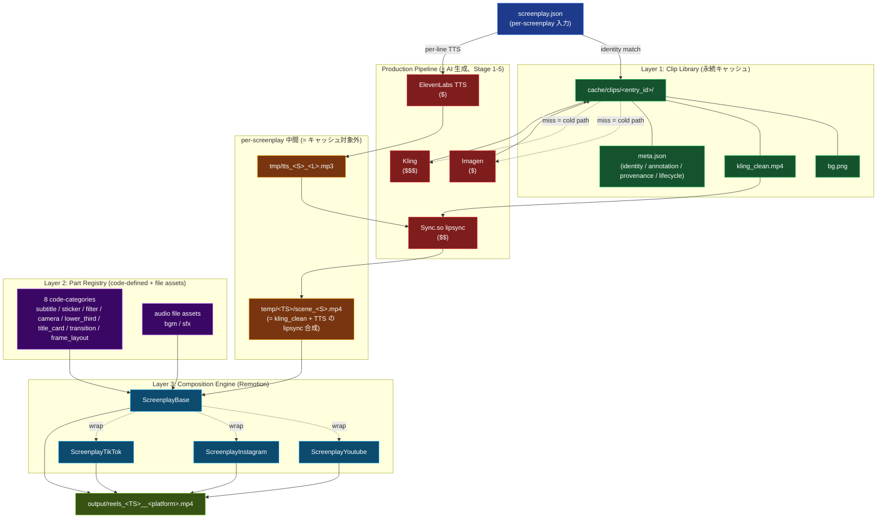
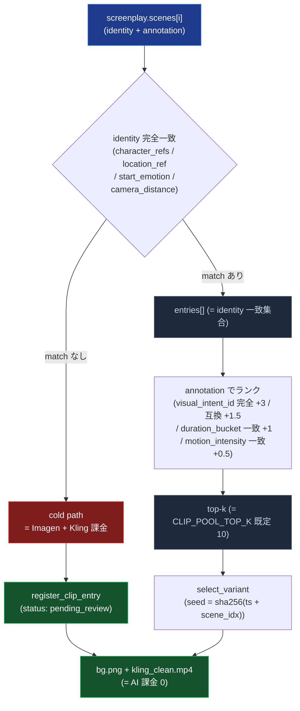
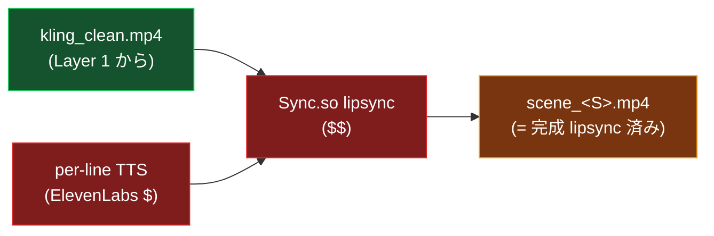
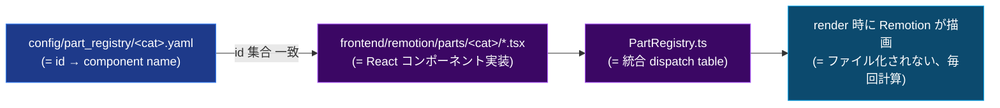
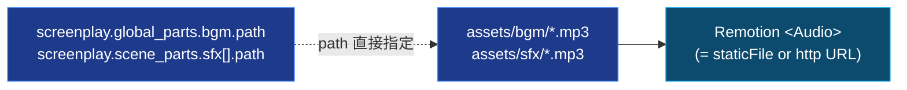
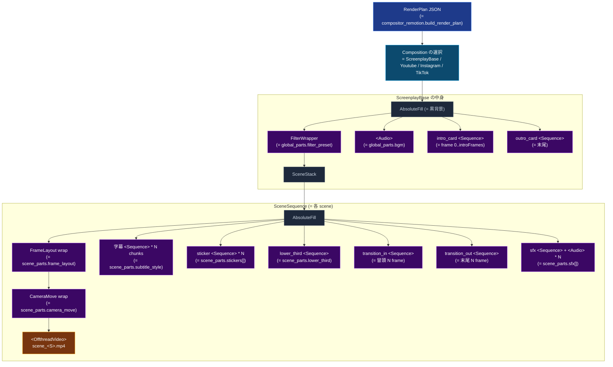
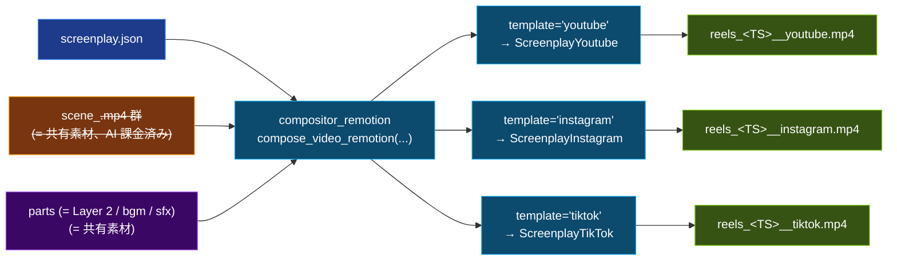
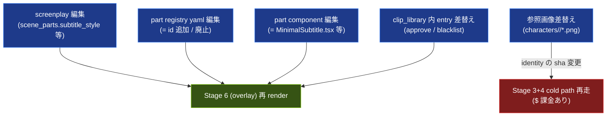

# Parts と Composition の現状図解

**date**: 2026-05-10 / **status**: 現状記述ドキュメント (= reference)

`2026-05-10_compositional-architecture.md` (= 設計案) で計画していた構造が
すべて main に入った時点での **「どのパーツが」「どんな粒度で」「どこから」
「どうキャッシュされ / 再利用され」「Remotion でどう組み立てられて」最終
mp4 になるか** を mermaid 記法で図解する。

---

## 0. 1 枚で全体像



色の意味:

- 🔴 **赤**: AI API 呼び出し (= 課金が発生する処理)
- 🟢 **緑**: 永続キャッシュ (= 2 回目以降ヒットすれば課金 0)
- 🟠 **オレンジ**: per-screenplay の中間生成物 (= キャッシュされない)
- 🟣 **紫**: code-defined パーツ (= ファイル化されないコンポーネント)
- 🔵 **青**: Composition エンジン (= Remotion)
- 🟢 **黄緑**: 最終成果物

---

## 1. パーツ一覧 (= 何がどんな粒度でパーツか)

| 大分類                  | パーツ                                                   | 粒度                                             | 実装の住所                                | 永続化            |
| ----------------------- | -------------------------------------------------------- | ------------------------------------------------ | ----------------------------------------- | ----------------- |
| **重い (= AI 生成)**    | bg.png                                                   | scene 単位                                       | `cache/clips/<id>/bg.png`                 | ✅ 永続キャッシュ |
| 同上                    | kling_clean.mp4                                          | scene 単位                                       | `cache/clips/<id>/kling_clean.mp4`        | ✅ 永続キャッシュ |
| **per-screenplay 中間** | tts*<S>*<L>.mp3                                          | line 単位 (= scene 内)                           | `temp/<TS>/tmp/tts_<S>_<L>.mp3`           | ❌ 一時           |
| 同上                    | scene\_<S>.mp4 (= lipsync 済み)                          | scene 単位                                       | `temp/<TS>/scene_<S>.mp4`                 | ❌ 一時           |
| **subtitle_styles**     | minimal / fade_in / karaoke_bold                         | chunk (= line を分割)                            | `frontend/remotion/parts/subtitles/*.tsx` | (= code)          |
| **stickers**            | exclaim_red / question_mark / sparkle / thumbs_up / fire | scene 内の `at` 秒 + duration                    | `parts/stickers/EmojiSticker.tsx`         | (= code)          |
| **filter_presets**      | none / warm_cinematic / cool_blue / monochrome / vintage | screenplay 全長                                  | `parts/filter_presets/FilterWrapper.tsx`  | (= code)          |
| **camera_moves**        | none / subtle_zoom_in / ken_burns / dolly_pull_back      | scene 単位 (= 動画レイヤをラップ)                | `parts/camera_moves/CameraMove.tsx`       | (= code)          |
| **lower_thirds**        | name_banner / role_caption / quote_box                   | scene 内の `at` 秒 + duration                    | `parts/lower_thirds/LowerThird.tsx`       | (= code)          |
| **title_cards**         | simple_intro / subscribe_outro / section_break           | screenplay 冒頭 (intro) / 末尾 (outro)           | `parts/title_cards/TitleCard.tsx`         | (= code)          |
| **transitions**         | cut / dip_to_black / dip_to_white / fade_quick           | scene 冒頭 N frame (= in) / 末尾 N frame (= out) | `parts/transitions/Transition.tsx`        | (= code)          |
| **frame_layouts**       | full / letterbox_top_bottom / centered_with_blur         | scene 単位 (= 動画レイヤを framing wrap)         | `parts/frame_layouts/FrameLayout.tsx`     | (= code)          |
| **bgm (audio file)**    | (= path 直接指定)                                        | screenplay 全長 (= ducking 可)                   | `assets/bgm/*.mp3` 等                     | (= file)          |
| **sfx (audio file)**    | (= path 直接指定)                                        | scene 内の `at` 秒                               | `assets/sfx/*.mp3` 等                     | (= file)          |

合計 **8 code-defined カテゴリ + bgm/sfx の audio + Layer 1 の 2 種** = 11 パーツ系統。

---

## 2. キャッシュと再利用の流れ

### 2.1 Layer 1 (= clip library) のヒット判定



ポイント:

- **identity (= 4 軸)** だけで pool を決める。`visual_intent_id` 等の annotation
  は **soft rank** に降りる
- 同じ `(character, location, start_emotion, camera_distance)` の clip は
  **screenplay 跨いで共有**される
- variant pool 内の選択は **(ts, scene_idx) seed で決定論的** (= 同じ
  screenplay の rebuild で同じ動画が出る)

### 2.2 per-screenplay 経路 (= 都度課金)



`scene_<S>.mp4` は **per-screenplay の組合せ** なので Layer 1 cache 対象外。
TTS は line 単位なので、将来 audio_clip cache (= line text + voice_id 等で hash)
を入れれば **同セリフの再課金は防げる** 余地はある (= 設計 doc §5.2 で言及、
Phase 5+ 検討事項)。

### 2.3 Layer 2 (= compositional parts) は **キャッシュなし**



- yaml と component の id 集合は **drift test** (`part_registry_yaml_drift.test.ts`) で
  常に一致が保証される
- パーツの差し替え / 新規追加で再 render するだけで反映、AI 課金不要
- 「render 時に毎回計算」と言っても字幕レンダリング等は数秒なので、キャッシュ
  する意味はない

### 2.4 audio file assets (= bgm / sfx)



- ファイル本体は `assets/` 配下にバージョン管理しない (= .gitignore)
- screenplay は path だけ持つ
- Remotion は staticFile() (= public/ 起点) か http URL で audio file を読む

---

## 3. Remotion での composition tree



### 3.1 wrapping 順序の不変条件

scene 動画の wrapping 順 (= 内側 → 外側):

1. `<OffthreadVideo>` (= 元動画 = scene\_<S>.mp4)
2. `CameraMove` wrap (= scale / translate transform)
3. `FrameLayout` wrap (= letterbox / blur background)

つまり **frame_layout の方が camera_move より外側**。
camera_move は scene 動画自体に適用、frame_layout は最終的なフレーミングを決める。

overlays (= subtitles / stickers / lower_third / transitions / sfx) は wrapping
されず、`<AbsoluteFill>` の上に並列で配置される (= 動画 transform の影響を
**受けない**)。

### 3.2 Sequence 配置の時間軸

```mermaid
gantt
  title 1 scene の時間軸 (= sceneFrames に対する各 part の Sequence 範囲)
  dateFormat X
  axisFormat %s
  section 動画
  scene_video (frame_layout + camera_move) :a1, 0, 100
  section 字幕
  chunk[0]                     :s1, 5, 35
  chunk[1]                     :s2, 35, 65
  chunk[2]                     :s3, 65, 95
  section オーバーレイ
  sticker @ at=20s             :st1, 20, 35
  lower_third @ at=10 dur=30   :lt1, 10, 40
  transition_in (冒頭)         :ti1, 0, 12
  transition_out (末尾)        :to1, 88, 100
  section 音声
  sfx @ at=15                  :sf1, 15, 25
```



各 `<Sequence from={...} durationInFrames={...}>` の `from` は scene 内
相対 frame で指定される。**from / duration の解決はすべて Python 側**
(`compositor_remotion.build_render_plan`) で行い、Remotion は数値を信用する
(= SSOT 不変条件)。

---

## 4. 全体データフロー (= screenplay → final mp4)

```mermaid
sequenceDiagram
  autonumber
  participant SP as screenplay.json
  participant SG as scene_gen.py
  participant CL as clip_library
  participant Imagen
  participant Kling
  participant TTS as ElevenLabs
  participant Sync as Sync.so
  participant CR as compositor_remotion
  participant RM as Remotion CLI
  participant OUT as reels_<TS>.mp4

  SP->>SG: load_project_screenplay(ts)

  loop 各 scene (= Stage 3+4)
    SG->>CL: lookup_clip_pool(scene.identity)
    alt warm hit
      CL-->>SG: bg.png + kling_clean.mp4 (課金 0)
    else cold miss
      SG->>Imagen: generate bg ($)
      Imagen-->>SG: bg.png
      SG->>Kling: generate kling ($$$)
      Kling-->>SG: kling_clean.mp4
      SG->>CL: register_clip_entry
    end
  end

  Note over SG,TTS: Stage 2: TTS one-shot (per-screenplay)
  SG->>TTS: 全 line を 1 call ($)
  TTS-->>SG: tts_<S>_<L>.mp3 群 + alignment

  loop 各 scene (= Stage 5)
    SG->>Sync: lipsync(kling_clean + tts_<S>_*) ($$)
    Sync-->>SG: scene_<S>.mp4
  end

  Note over SG,CR: Stage 6: overlay (= OVERLAY_BACKEND=remotion)
  SG->>CR: compose_video_remotion(scene_videos, sp, ts, output, template)

  CR->>CR: build_render_plan<br/>(= subtitle 解決 + part passthrough)
  CR->>CR: scene 動画を public/_render_<TS>/ にコピー
  CR->>RM: npx remotion render Screenplay&lt;Template&gt; output --frames=0-N --public-dir=...
  RM-->>OUT: 1080x1920 60fps h264 mp4
```

ポイント:

- **Stage 1-5 は既存 Production Pipeline** が担当 (= AI 生成 + Sync.so)
- **Stage 6 だけが Composition Engine 経由** (= ffmpeg または Remotion を
  `OVERLAY_BACKEND` で切替)
- Layer 1 cache (= clip_library) のヒットは Stage 3 + 4 の初回課金を 0 に
  落とす (= warm 状態)
- TTS / Sync.so は per-screenplay で常に発生 (= 設計上、line 内容は毎回違う前提)

---

## 5. Stage 8 publish: platform variant fan-out



**AI 課金は 1 回しか発生しない** (= Stage 1-5 は 1 回回せば 3 platform 分の素材になる)。
Remotion render が 3 回走るが、これは数十秒 - 数分の CPU 時間だけ。

各 template の差分:

| template    | 上書き内容                                                                              |
| ----------- | --------------------------------------------------------------------------------------- |
| `base`      | (= 既定、上書きなし)                                                                    |
| `youtube`   | outro_card 既定 = `subscribe_outro` 2.0s                                                |
| `instagram` | subtitle_style `minimal` を全 scene で `karaoke_bold` に強制                            |
| `tiktok`    | `karaoke_bold` 強制 + 字幕 y_from_bottom = 640 + outro_card 既定 = `section_break` 1.0s |

---

## 6. 編集 / 再 render の影響範囲



ポイント:

- **Layer 2 (= 軽いパーツ) の編集は AI 課金ゼロ** で反映
- **clip_library entry の操作 (= 承認 / blacklist)** も AI 課金ゼロ (= 既存 entry の
  on/off だけ)
- **参照画像差替えだけが Stage 3+4 再走 (= 課金)** を引き起こす。これは
  identity hash が変わるため新世代 entry が必要になるから

---

## 7. ファイル参照表 (= どのコードがどのパーツを担当するか)

| パーツ            | yaml SSOT                                   | TS 実装                                                      | Python 経路                                                            |
| ----------------- | ------------------------------------------- | ------------------------------------------------------------ | ---------------------------------------------------------------------- |
| Layer 1 clip      | `config/part_registry/visual_intents.yaml`  | -                                                            | `clip_library.py` / `bg_cache.py` / `kling_cache.py`                   |
| subtitle_styles   | `config/part_registry/subtitle_styles.yaml` | `frontend/remotion/parts/subtitles/*.tsx`                    | (= passthrough のみ、`compositor_remotion._scene_subtitle_style_part`) |
| stickers          | `config/part_registry/stickers.yaml`        | `frontend/remotion/parts/stickers/EmojiSticker.tsx`          | (= passthrough)                                                        |
| filter_presets    | `config/part_registry/filter_presets.yaml`  | `frontend/remotion/parts/filter_presets/FilterWrapper.tsx`   | `_normalize_global_parts`                                              |
| camera_moves      | `config/part_registry/camera_moves.yaml`    | `frontend/remotion/parts/camera_moves/CameraMove.tsx`        | (= passthrough)                                                        |
| lower_thirds      | `config/part_registry/lower_thirds.yaml`    | `frontend/remotion/parts/lower_thirds/LowerThird.tsx`        | (= passthrough)                                                        |
| title_cards       | `config/part_registry/title_cards.yaml`     | `frontend/remotion/parts/title_cards/TitleCard.tsx`          | `_normalize_global_parts`                                              |
| transitions       | `config/part_registry/transitions.yaml`     | `frontend/remotion/parts/transitions/Transition.tsx`         | (= passthrough)                                                        |
| frame_layouts     | `config/part_registry/frame_layouts.yaml`   | `frontend/remotion/parts/frame_layouts/FrameLayout.tsx`      | (= passthrough)                                                        |
| bgm (audio)       | (= ファイル直接指定)                        | `compositions/ScreenplayBase.tsx` 内 `<Audio>`               | `_normalize_global_parts`                                              |
| sfx (audio)       | (= ファイル直接指定)                        | `components/SceneSequence.tsx` 内 `<Audio>`                  | `compose_video_remotion` の sfx normalize                              |
| dispatch          | -                                           | `frontend/remotion/PartRegistry.ts`                          | -                                                                      |
| build_render_plan | -                                           | -                                                            | `compositor_remotion.build_render_plan`                                |
| Composition       | -                                           | `compositions/Screenplay{Base,Youtube,Instagram,TikTok}.tsx` | `composition_id_for_template`                                          |

---

## 8. 不変条件 (= この構造が壊れたら危険信号)

1. **Layer 1 cache 識別性**: `(character_refs, location_ref, start_emotion, camera_distance)` が一致する 2 つの scene は **必ず同じ entry pool に hit する**。これが崩れたら hit 率が落ちる
2. **Layer 2 は code 内のみ**: subtitle/sticker 等の見た目変更は **再 render だけ** で済む。AI 課金は発生しない
3. **timing 計算は Python SSOT**: subtitle chunk の絶対秒は `compositor.py / compositor_remotion.py` で一括解決。Remotion はその数値を信用するだけ
4. **drift test が yaml ↔ component を強制一致**: `part_registry_yaml_drift.test.ts` が壊れたら CI fail
5. **decision (= 何のパーツを使うか) は screenplay**: Composition (= Remotion) は受け取った plan を忠実に描画するだけで、勝手に演出を足さない

---

## 9. 関連ドキュメント

- `2026-05-10_compositional-architecture.md` (= 設計案、authoritative)
- `2026-05-10_remotion-integration-design.md` (= 設計途中スナップショット、superseded)
- `2026-05-10_clip-library-architecture.md` (= 設計途中スナップショット、superseded)
- `frontend/remotion/README.md` (= Composition Engine 実装 README + Phase 完了状況)
- `CLAUDE.md` の "利用可能な part categories" 表 (= 開発時のクイックリファレンス)
